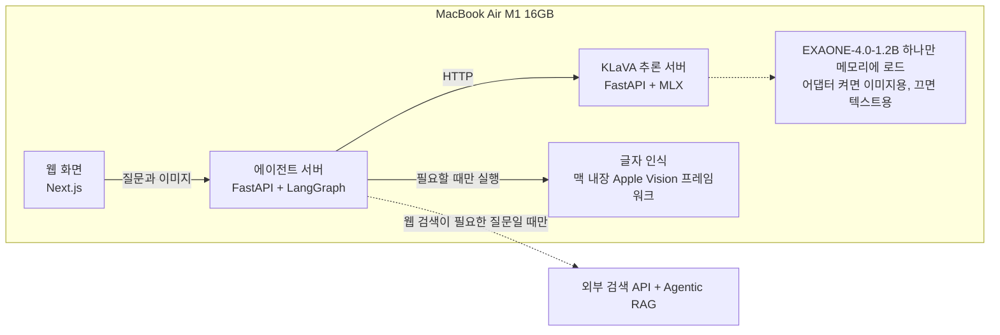
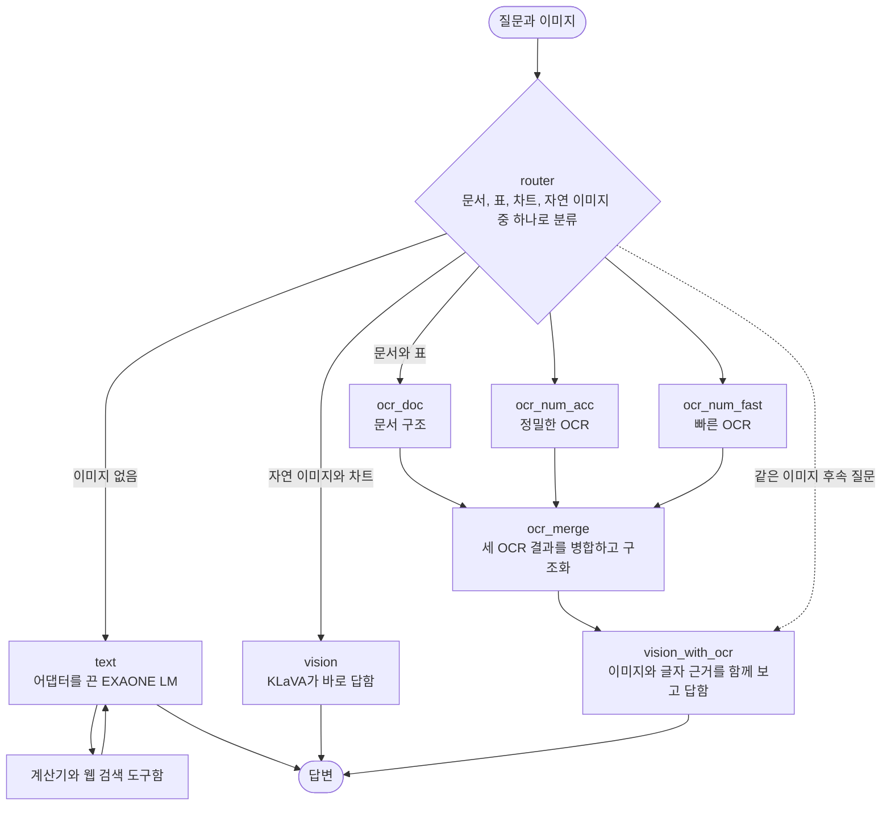

# KAVA(Korean Agentic Vision Assistant): 한국어 온디바이스 멀티모달 에이전트

한국어 소형 이미지 이해 모델(VLM)을 구축하고, 작은 맥북에서도 동작하는 에이전트를 구축한 프로젝트입니다.

프론티어 모델의 높은 API 비용과 데이터 유출 부담 때문에 open weight 모델이나 자체 모델로 눈을 돌리는 방향이 늘고 있습니다. 이러한 맥락으로부터 1.8B VLM을 로컬에서 최대 6GB 이내의 메모리 사용량으로 사용할 수 있는 멀티모달 파이프라인을 구성하고, 데이터 구축부터 학습, 평가, 서빙까지 전 과정을 구현하였습니다.


| 무엇을 했는가 | 그래서 어떻게 되었는가 |
|---|---|
| **한국어 중심 VLM 학습.** 구성 요소들을 실측을 통해 선정하고, 약 230만 규모의 학습 데이터를 구축해 2단계로 학습. | 관계 추론(GQA) **58.9**로 비교한 open weight 다섯 모델 중 가장 높음. Qwen2.5-VL 3B가 58.8, InternVL3 2B가 51.3. 시각 이해(K-SEED)에서도 높은 성능(**74.0**) |
| **그래프 구조를 적용해 낮은 문서 판독 성능을 향상.** 낮은 성능의 이유를 가설을 통해 확인하고, 세 경로로 나누어 근거가 도움이 되는 경로에만 OCR 결과를 삽입. | 한국어 문서와 표, 차트 판독(K-DTCBench) 정확도가 **44.2%에서 62.1%로** 향상. 문서는 52.5%에서 **86.2%로** 향상. |
| **16GB 맥북 안에서 여유 있는 구동.** OCR 서버를 없애고, 추론 스택을 애플 실리콘용으로 다시 구현. | 이미지 한 장 글자 인식이 같은 맥에서 **9.8초에서 0.6초로**. 모델 첫 로딩 **78.4% 단축**, e2e 생성 속도 **71.4% 향상** |
| **언어 모델 재사용.** 이미 잘 학습된 언어 모델을 텍스트만 사용하는 경로에서 VLM의 언어 모델을 공유된 메모리에서 사용. | 텍스트 질문용 언어 모델을 따로 올리지 않음. 사용 중 피크 메모리 **6GB 이내** |
| **교체 가능한 서빙 구조.** 세 프로세스로 나눠 의존성을 분리하고, 추론 백엔드를 환경변수로 갈아끼울 수 있게 설계. SSE 스트리밍 계약과 세션 트랜잭션을 정의. | MLX로 구동할 때 서버 프로세스에서 **PyTorch 계열 377MB 제거**. 완료 이벤트가 정확히 한 번 나가고, 중복 요청은 409로 거절 |

---

## 무엇을 만들었나

- **KLaVA** (Korean Language and Vision Assistant): 이미지를 보고 한국어로 답하는 약 1.8B 모델. 한국어에 특화된 EXAONE-4.0-1.2B와 Siglip2 So400m 비전 인코더를 연결하였습니다.
- **KAVA** (Korean Agentic Vision Assistant): LangGraph를 기반으로 KLaVA를 눈으로 사용하는 에이전트.

KLaVA 가중치는 [Hugging Face](https://huggingface.co/PangS00oo/EXAONE-KLaVA-1.8B)에 공개했습니다. 연구와 교육 목적으로 사용할 수 있습니다.



최신 또는 외부 정보를 가져와 맥락을 보강하기 위해 웹 검색 도구를 호출하는 경우에 검색어만 밖으로 나갑니다.

<!-- 동작 화면: docs/presentation/demo.gif 를 여기에 넣습니다.
     문서 이미지를 올린 상태, 단계 표시가 "이미지에서 글자를 읽는 중"으로 바뀌는 순간,
     답이 한 글자씩 흘러나오는 구간이 담기면 됩니다. -->

---

# 1. 한국어 중심 VLM 구축

비전 인코더(이미지를 이해하는 부분)과 언어 모델(말을 만드는 부분)을 **커넥터**로 이어 붙인 구조입니다. 커넥터는 비전 인코더가 추출한 시각 토큰들을 언어 모델이 인식하는 토큰으로 바꿔주는 작은 신경망입니다.

| 구성 요소 | 무엇 | 크기 |
|---|---|--:|
| 언어 모델 | EXAONE-4.0-1.2B | 1.28B |
| 이미지 인코더 | SigLIP2-so400m-patch16-naflex | 0.41B |
| 커넥터 | 2층 MLP | 0.007B |
| | **합계** | **약 1.8B** |

## 구성 요소들은 실측을 통해 선택

**언어 모델.** 후보 네 개의 토크나이저에 같은 한국어 문장을 직접 넣어 봤습니다. 토크나이저는 글을 모델이 처리하는 단위인 토큰으로 쪼개는 도구입니다.

EXAONE은 `게임`과 `비디오`를 통째로 유지하는데 Qwen3는 `게`와 `임`처럼 음절로 쪼갰습니다. 예시 3문장 합계로 EXAONE이 132토큰, KANANA와 Llama가 146토큰, Qwen3가 177토큰이었습니다. **영어에서는 네 모델이 비슷했고 한국어에서만 크게 차이가 있었습니다.**

온디바이스에서 토큰 수는 곧 지연 시간과 연결되며, 짧은 컨텍스트 윈도우에서 중요합니다. 이 차이를 근거로 EXAONE을 언어 모델로 채택하였습니다.

**이미지 인코더.** 가변 해상도를 지원하는 SigLIP2 NaFlex를 골랐습니다. 이미지 크기와 상관없이 토큰 예산이 고정되고, 남는 자리를 마스크로 걸러낼 수 있습니다. 실제 이미지들은 해상도와 종횡비가 불규칙하므로 가장 적합하다고 생각하였습니다.

**시각 토큰 예산.** 이미지 한 장을 몇 개의 토큰으로 볼지를 576에서 784로 늘렸습니다. 예산을 늘린 비교 실험에서 K-DTCBench가 3.4점 올랐고 특히 표가 40.0에서 47.5로 올랐습니다. 문서는 변화가 없었고 속도는 같았습니다. 

## 직접 구축한 이미지 인코더는 폐기

**무엇이 문제였나.** 처음에는 직접 설계한 인코더를 썼습니다. 계층형으로 쌓아서, 해상도가 높아 토큰이 많은 앞 단계에서는 2D 공간 관계를 잡으면서 계산량이 토큰 수에 선형으로 비례해서만 늘어나는 믹서를 쓰고, 해상도가 낮아진 뒤 단계에서는 표현력이 높은 어텐션을 믹서로 쓰는 구조였습니다. ImageNet-1K로 직접 사전학습해서 붙였습니다.

**어떻게 판단했나.** 비전 인코더만 바꾸고 나머지는 전부 고정해 ablation study를 수행했습니다.

**결과.** 전 항목에서 SigLIP2가 훨씬 앞섰습니다.

| 벤치마크 | 직접 만든 인코더 | SigLIP2 | 변화 |
|---|--:|--:|--:|
| K-MMBench | 41.5 | 60.7 | + 19.2 |
| MMBench-EN | 47.2 | 63.8 | + 16.6 |
| K-SEED | 56.2 | 70.1 | + 13.9 |
| SEED-IMG | 58.5 | 69.8 | + 11.3 |
| ScienceQA | 54.7 | 62.8 | + 8.1 |
| GQA | 53.0 | 58.5 | + 5.5 |
| MME | 1359.2 | 1554.4 | + 195.2 |
| **K-DTCBench (문서/표/차트)** | **38.8** | **40.8** | **+ 2.0** |

**이로부터 배운 점.**

첫째, 90M 규모의 파라미터에서 400M으로 파라미터를 늘리는 것이 매우 큰 성능 향상을 가져다 주었습니다. 상대적으로 작은 모델에서는 파라미터의 규모를 늘리는 것만으로도 큰 폭의 성능 향상을 기대할 수 있습니다.

둘째, 작은 모델에서는 인코더를 얼마나 큰 데이터로 사전학습했는지가 성능에 가장 큰 영향을 줍니다.

셋째, **문서 판독만 2.0점밖에 오르지 않았습니다.** 다른 항목이 10점에서 19점씩 오르는 동안 여기만 성능 향상이 제한적이었습니다. 인코더를 바꿔서 풀릴 문제가 아니라고 생각하게 되었습니다.

## 학습 데이터 설계

LLaVA에서 제안한 언어 모델과 비전 인코더의 연결 방식을 따라 두 단계에 걸쳐 학습 데이터셋을 구축하였습니다.

**1단계**는 커넥터만 학습시켜 이미지와 말을 정렬합니다. 언어 모델과 이미지 인코더의 가중치는 freeze합니다. 총 839,691개, 한국어 캡션의 비율은 73%입니다.

**2단계**는 LoRA 어댑터와 커넥터, 이미지 인코더를 함께 학습시킵니다. LoRA는 원래 가중치는 그대로 두고 작은 보조 행렬만 학습시키는 방법이라 원 언어 모델의 지식 망각을 방지하면서 메모리를 훨씬 덜 씁니다. 총 1,460,408개입니다.

이 단계에서 세 가지를 신경 썼습니다.

- **비율 균형.** 문서와 글자 인식, 차트와 표를 전체 데이터의 30% 비율로 맞췄습니다. 범용 언어 및 시각 능력을 유지하면서 문서 작업이 가능하게 했습니다.
- **기존 능력 유지.** 영어 데이터 183,934개와 한국어 텍스트 데이터 99,523개를 섞었습니다. 한국어 사용시 영어에 대한 이해도 필수적이므로, 기존 지식의 망각을 방지하고자 하였습니다.
- **부족한 능력은 합성 데이터로 보완.** 수집하기 어려운 데이터는 합성 데이터를 사용했습니다. 표와 차트에서 헤더와 셀이 밀려 읽히는 것을 바로잡는 구조 판독(표 998장과 차트 998장에 각각 8종 과제), 이미지에 없는 행이나 열을 물었을 때 지어내지 않고 없다고 답하는 근거 거부, 이미지 종류를 네 단어 중 하나로만 답하는 분류 과제, 잘린 영역을 읽거나 작아서 확신할 수 없는 대상의 위치를 좌표로 제시하는 과제입니다. reasoning을 위한 한국어 사고 과정 데이터도 2,472개 만들었습니다.

전체 구성은 [`docs/dataset_samples/VLM_DATASETS.md`](docs/dataset_samples/VLM_DATASETS.md)에 정리했습니다.

## 학습 과정에서 부딪힌 문제들

| 문제 | 원인 | 해결 방법 |
|---|---|---|
| 오른쪽 패딩이 있는 배치에서 위치 정보가 깨짐 | 언어 모델 기본 구현이 위치 번호를 단순 순번으로 매김 | 어텐션 마스크 누적합으로 위치 번호를 직접 계산해 넘김 |
| 텍스트만 있는 배치에서 커넥터가 학습에서 빠짐 | 여러 GPU로 나눠 학습할 때 안 쓰인 파라미터가 오류를 냄 | 손실에 0을 곱한 항을 더해 항상 연결되게 만듦 |
| 가변 해상도의 빈 자리가 언어 모델 입력에 섞임 | NaFlex는 이미지마다 유효한 패치 수가 다름 | 마스크로 걸러 실제 패치만 이어 붙임 |
| `<image>` 자리 표시를 토크나이저가 어떻게 쪼갤지 보장할 수 없음 | 토크나이저마다 다르게 처리함 | 문자열을 나눈 뒤, 사전에 정의한 인덱스를 삽입 |

학습은 A100 40GB 4장에서 AMP(bf16 + fp32 마스터 파라미터)으로 진행하였으며, stage 2 기준 11,410 스텝, 약 32시간 소요되었습니다.

## 성능 평가

비슷한 동급 모델 네 개를 12개의 벤치마크에서 VLMEvalKit을 사용해 비교했습니다. 8개의 객관식 벤치마크들에서는 모두 같은 LLM 판정기(Sonnet 5)를 사용했고, 나머지 4종은 규칙 기반으로 채점했습니다.

| 모델 | K-MMBench | K-MMStar | K-SEED | K-DTCBench | MMBench-EN | MMStar | SEED-IMG | ScienceQA | GQA | POPE | MME | TextVQA |
|---|--:|--:|--:|--:|--:|--:|--:|--:|--:|--:|--:|--:|
| **KLaVA (1.8B)** | 64.3 | 42.7 | **74.0** | 44.6 | 67.4 | 40.2 | 70.9 | 61.4 | **58.9** | 86.1 | 1517.5 | 47.6 |
| VARCO-VISION-2.0 (1.7B) | 70.4 | 51.0 | 72.3 | 68.8 | 76.8 | 54.7 | 74.5 | 83.9 | 51.9 | 88.6 | 1786.7 | 78.2 |
| Qwen2.5-VL-Instruct (3B) | 72.3 | 50.1 | 72.2 | 82.1 | 79.7 | 56.9 | 73.8 | 81.6 | 58.8 | 86.2 | 2166.9 | 81.0 |
| InternVL3 (2B) | 69.2 | 51.8 | 68.7 | 67.9 | 80.7 | 60.5 | 74.7 | 95.8 | 51.3 | 90.0 | 2127.0 | 79.0 |
| Kanana-1.5-V (3B) | 72.4 | 49.3 | 74.6 | 87.5 | 76.3 | 53.7 | 73.2 | 95.9 | 15.4† | 86.0 | 1980.0 | 78.0 |

MME는 원점수 합(만점 2800), POPE는 F1, 나머지는 정확도입니다. `†` Kanana의 GQA 15.4는 단답을 잘 하지 못한 결과입니다.

- **강점.** 시각 이해를 평가하는 K-SEED 74.0은 Kanana 74.6에 근접하고, 관계 추론을 평가하는 GQA 58.9는 비교한 다섯 모델 중 가장 높습니다.
- **약점.** 한국어 문서와 표, 차트를 읽는 K-DTCBench가 44.6입니다. 비교 모델들은 67.9에서 87.5의 성능을 갖습니다.

자세한 내용은 [`docs/vlm_comparison/README.md`](docs/vlm_comparison/README.md)에 있습니다.

---

# 2. 그래프 구조를 통한 약점 보완 및 에이전트화

비전 인코더를 바꾸고, 시각 토큰의 개수를 늘려도 문서 판독만 성능 향상이 거의 없었습니다. 파라미터를 늘려 다시 학습을 시키는 것도 제한된 자원에서는 어려웠습니다. 그래서 모델을 고치는 대신 **모델에게 근거를 주는 경로**를 만들기로 하고, 먼저 왜 성능이 안 나오는 지부터 확인했습니다.

## 가설을 설정해 낮은 성능의 원인을 파악

**가설.** 문서와 표를 못 읽는 것이 비전 인코더가 글자를 못 읽어서가 아니라, 정답이 있는 좁은 영역에 배정되는 토큰이 너무 적어서라면, **그 영역만 잘라서 같은 예산으로 다시 보여줄 때 같은 모델이 같은 질문을 더 잘 읽어야 한다.**

**설계.** 실패한 7개의 샘플을 골라 원래 질문과 함께 "글자를 그대로 옮겨 적어라"는 질문을 같이 던져서, 같은 설정에서 **글자를 인식하는지와 답이 맞았는지를 각각 보았습니다.**

**결과.** 전체 이미지를 전달한 7개의 샘플에서는 모두 틀린 반면, 잘라낸 이미지로는 7개 중 4개가 맞았습니다.

가변 해상도 인코더는 이미지 면적과 상관없이 토큰 예산이 고정입니다. 답변의 근거가 되는 필요한 영역만 잘라서 이미지를 주면 같은 예산이 그 영역에만 사용될 수 있습니다. 한 예시에서는 근거 영역 기준 밀도가 약 19배 올랐습니다.

**여기서 실패가 두 원인으로 나뉘었습니다.**

| 원인 | 샘플 수 | 무엇을 뜻하나 | 사례 |
|---|--:|---|---|
| 해상도 부족 | 4 | 잘라 보여주면 풀린다 | 전화번호 뒷자리를 나타내는 글자가 568에서 5678로 잘 인식 |
| 읽어도 답을 만들지 못함 | 3 | 근거가 되는 글자를 더 줘도 풀리지 않는다. 읽은 값을 합치거나 계산하는 단계에서 막힌다 | 180, 210, 240, 270이라는 숫자를 잘 읽고도 합산을 못 해 270으로 답함 |

**그렇다면 근거가 되는 영역을 스스로 짚을 수 있는가?** 이미지를 3x3 격자로 나누고 근거가 어느 칸이냐고 물으니 6건 모두에서 틀렸습니다. 보기 순서를 뒤집어 다시 재도 세로축은 6건 모두 첫 보기를 되풀이했습니다. 즉, 모델이 스스로 근거가 되는 영역을 짚을 수 없었습니다.

## 잘라 읽는 대신 구조화된 텍스트를 넣기로

가설은 확인됐지만, 이 방식을 실제 파이프라인에 그대로 올릴 수는 없었습니다. 잘라 읽는 경로는 모델이 못 하는 일을 두 개나 요구하기 때문입니다.

| 필요한 것 | 모델이 할 수 있나? | 근거 |
|---|---|---|
| 어디를 자를지 정하기 | X | 3x3 격자 위치 질문 6건 모두 오답. 보기 순서를 뒤집어도 첫 보기만 반복 |
| 잘라 읽은 조각을 합치기 | X | 네 값을 정확히 읽고도 합산 실패 |

둘 다 supervisor와 같은 외부 모델이 대신 해야 합니다. 그런데 이미지 경로에 supervisor(EXAONE-4.0-1.2B)을 얹어본 실험에서는 단일 모델의 사용 결과보다 정확도와 지연 시간 모두 열세였습니다. 또한, 제한된 메모리에서 공유 메모리에서 동작하는 supervisor를 제외한 다른 모델을 함께 올릴 여유도 없었습니다.

**그래서 방향을 바꿨습니다.** 모델에게 어디를 볼지 시키는 대신, OCR이 이미지 전체를 한 번에 읽어 **구조를 살린 텍스트로 만들어 컨텍스트에 넣습니다.**

| | 잘라서 다시 읽히기 | 구조화된 텍스트 주입 |
|---|---|---|
| 어디를 볼지 | 누군가 정해 줘야 함 | 정할 필요 없음. 전체를 훑는다 |
| 취합 | 조각을 다시 합쳐야 함 | 표를 셀 구조 그대로 받으므로 부담이 줄어듦 |
| 위험 | 잘못 자르면 근거가 통째로 사라짐 | 잘못 읽은 글자가 그대로 전달 |
| 이미지당 모델 호출 | 여러 번 | 한 번 |

텍스트 주입시 발생하는 위험은 병합 규칙과 경로 설계로 막았습니다. OCR에서 인식되지 않은 빈 칸은 지어내지 않도록 `[미인식]`로 남기고, 여러 OCR을 병렬로 돌려 신뢰성을 높입니다.

**잘라서 다시 읽히는 경로는 검증만 해두고 이번 구성에는 넣지 않았습니다.** 모델이 읽은 값을 스스로 합칠 수 있게 되면 그때 다시 붙일 계획입니다.

## 그래프 구조



먼저, 라우터가 이미지를 네 종류로 나눕니다. 문서와 표만 OCR 세 갈래를 동시에 태우고, 병합하면서 제목과 문단, 표를 구조 그대로 살린 텍스트로 만듭니다. 이 텍스트를 컨텍스트에 넣고 같은 이미지를 다시 묻습니다. 자연 이미지와 차트는 글자 인식 없이 바로 갑니다. 텍스트만 있는 질문은 어댑터를 끈 언어 모델이 계산기와 웹 검색을 쓰며 답합니다.

**차트는 OCR 결과를 사용하지 않습니다.** 차트는 글자가 구조를 이루지 않아 글자 근거가 도움이 되지 않습니다. 어떤 차트에서는 가로축의 "20대"가 `2q`로 깨져 읽혔는데, 이걸 컨텍스트에 넣자 원래 맞히던 답을 오히려 틀렸습니다. 따라서 차트는 사진과 같은 경로로 보냅니다.

| 단계  | 평균 | 하는 일 |
|---|--:|---|
| `router` | 4.4초 | KLaVA가 네 단어 중 하나로만 답함. 최대 8토큰 |
| `ocr_doc` | 0.6초 | 문서 구조 인식 |
| `ocr_num_acc` | 0.5초 | 숫자 정밀 인식 |
| `ocr_num_fast` | 0.1초 | 숫자 고속 인식 |
| `ocr_merge` | 0.0초 | 세 결과를 병합하고 구조를 살려 텍스트로 만듦 |
| `vision_with_ocr` | 7.1초 | 그 텍스트를 컨텍스트에 넣고 다시 답함 |
| `vision` | 5.6초 | 사진과 차트에서 즉답 |

세 갈래 글자 인식은 동시에 돌기 때문에 실제로 필요한 시간은 셋 중 가장 느린 0.6초입니다.

## 라우터의 분류 정확도

라우터 분류 정확도는 아래의 표와 같습니다.

| 실제 종류 | 맞힌 비율 |
|---|---|
| 사진 | 200장 중 198장 |
| 문서 | 40장 중 36장 |
| 차트 | 40장 중 35장 |
| **표** | **40장 중 20장** |

대부분의 경우 잘 분류하지만, 표는 절반이나 문서로 잘못 분류됩니다. 하지만 **표와 문서는 같은 경로를 타므로 잘못 보내도 결과가 같습니다.** 실제로 갈라져야 하는 것은 차트뿐입니다. 차트는 40장 중 35장을 제대로 잡고, **다른 종류가 차트로 잘못 가는 경우는 320장 전체에서 한 장도 없었습니다.**

## 결과

같은 설정에서 K-DTCBench의 240개 문항에서 단일 모델(KLaVA)과 그래프 구조(KAVA)를 비교했습니다.

| 구분 | KLaVA | KAVA | 변화 |
|---|--:|--:|--:|
| **K-DTCBench 전체 (240문항)** | **44.2%** | **62.1%** | **+17.9** |
| 문서 (80문항) | 52.5% | 86.2% | +33.7 |
| 표 (80문항) | 37.5% | 57.5% | +20.0 |
| 차트 (80문항) | 42.5% | 42.5% | - |
| K-SEED (자연 이미지) | 71.4% | 71.4% | - |
| 문항당 평균 시간 | 5.6초 | 9.7초 | 4.1초 증가 |

구조화된 텍스트를 넣어 주면 어디에 무엇이 있는지는 해결되지만, 여러 셀을 읽어 비교하고 합치는 일은 여전히 모델의 몫이므로 문서보다 표에서의 성능 향상이 작았습니다.

차트와 자연 이미지 경로는 단일 모델과 동일하므로 정확도는 같으나, 앞단의 라우터의 영향으로 지연 시간이 증가합니다.

원본 기록은 [`reports/inference/`](reports/inference/) 아래에 문항별로 남아 있습니다.

---

# 3. 16GB 맥북 안에서 여유 있게 동작하게 만들기

에이전트를 실제로 맥북에 올리려니 세 문제가 있었습니다. OCR 서버가 메모리에 올라가 5GB나 차지하고 있었고, 모델 추론이 긴 문맥에서 메모리 사용량이 너무 높았고, 텍스트 질문용 언어 모델을 따로 올릴 자리가 없었습니다.

## OCR 서버 대체

**무엇이 문제였나.** PaddleOCR과 PPStructureV3 기반의 OCR 서버는 별도의 가상환경과 메모리 사용이 필요했습니다. 같은 맥북에서 이미지 한 장에 9.8초, 표 구조 분석은 17.5초나 시간이 필요했습니다.

**어떻게 판단했나.** 더 가벼운 파이썬 모델을 찾는 대신, 맥에 이미 들어 있는 글자 인식 기능을 쓰기로 했습니다. Swift로 감싸 실행 파일 하나로 만들고 필요할 때만 호출하게 했습니다.

**결과.** 지연 시간이 평균 0.6초로 약 16배 빨라졌고, 파이썬 가상환경과 모델 다운로드와 서버를 없애 불필요한 용량과 메모리 사용량도 없앨 수 있었습니다.

**왜 세 경로로 나눴나.** 맥의 글자 인식은 모드에 따라 장단점이 있습니다.

| 경로 | 무엇을 뽑나 | 왜 필요한가 |
|---|---|---|
| 문서 구조 | 제목과 문단과 목록과 표를 구조 그대로 | 표와 문서의 구조를 마크다운 형식으로 보존하여 모델에 전달 가능 |
| 숫자 정밀 | 언어 교정을 켠 정확 모드 | 문맥으로 글자를 보정하므로 대부분의 숫자가 정확 |
| 숫자 고속 | 언어 교정을 끈 빠른 모드 | 언어 교정이 오히려 숫자를 단어로 바꿔 버리는 경우가 있어 보정에 사용 |

세 경로를 종합해 병합 단계에서 어느 값을 쓸지 선택합니다.

**표 셀을 채우는 규칙 설계.**

- 빈 칸은 임의로 채우지 않고 `[미인식]`으로 남깁니다. 모델에 오류 전파를 사전에 차단하기 위함입니다.
- 숫자는 자릿수가 일치할 때만 바꿉니다. 단위와 접두사는 보존합니다. `45.0%`를 `45`로 덮어쓰면 단위가 사라집니다.
- 같은 행에 소수점 형태가 셋 이상이면 누락된 소수점을 복원합니다. `12.0`, `15.0`, `18.0` 사이에 낀 `210`은 `21.0`일 가능성이 높습니다.
- 좌표는 소수점 두 자리로 반올림합니다. 모델이 두 자리 정규화 좌표로 학습됐기 때문입니다.

**여기서 배운 점.** 의존성을 더하는 것만이 해결책은 아닙니다. 플랫폼에서 이미 지원하는 프레임워크를 잘 사용해 최적화할 수 있습니다.

## 추론 스택을 애플 실리콘용

**무엇이 문제였나.** PyTorch로 돌리면 긴 문맥에서 메모리가 사용량이 비정상적으로 높아졌습니다. Reasoning까지 켠 텍스트 질문 하나에서 최대 메모리가 17.03GB까지 올라갔습니다. 16GB 기기에서는 스왑이 발생합니다.

**어떻게 판단했나.** 전처리와 이미지 인코더, 커넥터, 언어 모델을 애플 실리콘용 프레임워크인 MLX로 다시 구현하고 환경 변수로 바꿀 수 있게 만들었습니다.

**결과.** 같은 입력으로 순서를 바꿔가며 확인했습니다.

| 지표 | PyTorch | MLX | 변화 |
|---|--:|--:|--:|
| 첫 로딩 | 12.592초 | 2.715초 | 78.4% 단축 |
| 첫 토큰까지 (TTFT) | 4.033초 | 2.505초 | 37.9% 단축 |
| 응답 완료까지 | 5.789초 | 3.533초 | 39.0% 단축 |
| 생성 속도 (Decoding) | 8.53 토큰/초 | 14.61 토큰/초 | 71.4% 향상 |
| 스왑 발생량 | 1,045.9MiB | 9.4MiB | 거의 사라짐 |
| 긴 문맥 질문 최대 메모리 | 17.03GB | 2.69GB | 여유 있는 메모리 사용량 |

빨라지기만 한 것은 의미가 없어서 정확도도 확인했습니다. 백엔드만 바꾸고 같은 질문에 대한 응답을 비교했을 때, 243문항 중 답이 다른 것이 6건이었고 문항당 소요는 8.7초에서 4.1초로 줄었습니다. 그래서 기본값을 MLX로 바꿨습니다.

## 언어 모델의 재사용

**무엇이 문제였나.** 텍스트에 이미 잘 학습되어 특화된 언어 모델을 따로 올리면 1.2B 가중치를 메모리에 추가로 올려야했습니다.

**어떻게 판단했나.** 언어 모델을 한 번만 올려두고, LoRA 어댑터를 켜면 이미지용 KLaVA, 끄면 텍스트용 모델로 썼습니다. 그런데 쓰던 라이브러리에는 어댑터를 끄는 기능이 없었습니다. 한 번 붙이면 되돌릴 수 없는 구조였습니다.

**결과.** LoRA 레이어를 원본 Linear로 되돌리게 했습니다. 원본 가중치 객체를 그대로 들고 있다가 되돌려 끼우는 방식이라 가중치를 복사하지 않고 요청마다 키고 낄 수 있었습니다.

---

## 구동에 필요한 메모리와 지연 시간

**메모리**

| 항목 | 값 |
|---|---|
| 모델 가중치 (bf16) | 3.39GB. (언어 모델 2.61GB, 이미지 인코더 0.77GB, 커넥터 0.01GB) |
| 이미지 질문 처리 중 최대 (MLX) | 약 5.3GB |
| 이미지 질문 처리 중 최대 (PyTorch) | 9.72GB. 시각 토큰 784개의 prefill 과정에서 활성화 값이 약 6.3GB를 차지합니다 |
| 글자 인식 | 서버에 올리지 않고 맥에서 지원하는 프레임워크를 사용합니다. |
| 텍스트 질문용 별도 언어 모델 | 같은 모델에서 어댑터만 꺼 공유된 메모리에서 재사용합니다 |

**지연** (MacBook Air M1 16GB, PyTorch 백엔드, 1,736문항 전수 실행 실측)

| 질문 유형 | 모델 단독 | 에이전트 |
|---|--:|--:|
| 문서나 표 이미지 질문 | 5.6초 | 9.7초 |
| 사진 이미지 질문 | 6.7초 | 10.3초 |

MLX 백엔드로 바꾼 뒤 같은 조건에서 전수 재측정은 하지 않았습니다. 같은 입력을 두 백엔드로 번갈아 돌린 비교에서는 응답 완료까지 걸리는 시간이 39.0% 줄었습니다.

---

# 4. 서빙과 API 설계

웹 화면, 에이전트 API(FastAPI), KLaVA 추론 서버(FastAPI)의 세 프로세스로 나누어 서빙합니다.

한 사람이 로컬에서 쓰는 것을 전제로 합니다. **한 프로세스 안에서 상태가 깨지지 않는 것**과 **스트리밍 중에 무엇이 화면으로 나가는지**에 집중하고, 다중 워커나 프로세스 재시작 후 상태 복원은 현재 지원되지 않습니다.

## 스트리밍 계약 고정

토큰이 한 글자씩 흘러나오는 화면을 만들려면 SSE가 필요한데, SSE는 첫 바이트가 나간 뒤에는 상태 코드를 바꿀 수 없습니다. 그래서 계약을 먼저 정하고 시작했습니다.

이벤트는 네 종류입니다. `progress`(진행 단계), `delta`(답변 조각), `done`(완료), `error`. **진행 알림은 여러 번, 조각도 여러 번, 완료는 정확히 한 번**이고 항상 마지막입니다. 시작한 뒤에 생긴 오류는 상태 코드 대신 `error` 이벤트로 나갑니다.

최종 답변은 조각을 이어 붙인 것이 아니라 그래프 상태에서 따로 꺼냅니다. 이번 턴에 생성된 메시지만 잘라서 뒤에서부터 훑고, 도구 호출을 요청한 중간 메시지는 건너뜁니다. 그래서 조각이 유실되거나 도구 호출 태그가 새어 나가도 턴이 끝나는 순간 화면이 스스로 교정됩니다. 웹 화면은 이 계약에 기대어, 누적한 조각을 임시 표현으로만 쓰고 `done`이 오면 통째로 교체합니다.

스트리밍에서 실제로 겪은 문제와 처리는 이렇습니다.

| 문제 | 발생 이유 | 해결 방법 |
|---|---|---|
| 화면에 `<tool` 같은 반쪽 태그가 보임 | 도구 호출 태그가 청크 경계에 걸려 쪼개져 도착합니다 | 다음 청크에서 태그로 이어질 수 있는 꼬리 길이를 계산해 그만큼 보류합니다. 태그 앞 공백도 함께 보류합니다. 태그가 제거되면 공백만 덩그러니 남기 때문입니다 |
| 사고 과정이 그대로 노출됨 | 추론 모드의 출력이 답변보다 먼저 나옵니다 | 종료 태그가 나올 때까지 전부 보류합니다 |
| 도구 호출 JSON이 깨짐 | 소형 모델의 형식 이탈 | 깨진 호출은 세어 두고, 성공한 호출이 하나도 없으면 다시 시도하라는 문장을 본문에 붙여 모델에게 다시 전달합니다 |
| 사고 과정만 하다가 토큰 예산 소진 | 추론이 닫히지 않고 끝남 | 서버가 종료 여부를 함께 내려주고, 어댑터가 "질문을 단순화하라"는 문구로 번역합니다 |

에이전트 내부 상태가 화면으로 새지 않는 것도 계약의 일부입니다. 그래프가 진행 알림을 보낼 때는 사람이 읽을 문구 한 줄만 담고, 상태 전체나 디버그 스트림은 화면으로 전달하지 않습니다.

## 자체 서버를 LangGraph 도구 호출 루프에 연결

**무엇이 문제였나.** LangGraph의 도구 호출 루프는 LangChain 채팅 모델 인터페이스를 전제로 합니다. 그런데 KLaVA 서버는 OpenAI 호환이 아닌 자체 스키마이고, 도구 호출도 구조화된 필드가 아니라 **본문 안의 태그**로 돌려줍니다.

**어떻게 판단했나.** 서버를 OpenAI 호환으로 바꾸는 대신, `BaseChatModel`을 상속한 어댑터를 통해 아래의 네 가지를 맞추었습니다.

| 맞춰야 했던 것 | 방법 |
|---|---|
| 도구 스키마 | LangChain이 만든 스키마를 OpenAI function 형식으로 바꿔 서버에 넘기고, 서버가 채팅 템플릿에 주입합니다 |
| 호출 식별자 | 서버가 호출 id를 주지 않아 어댑터가 직접 만들어 붙입니다. 도구 결과를 어느 호출에 대응시킬지가 이 id로 정해집니다 |
| 스트리밍 형식 | 화면용 조각을 흘리다가 마지막 조각 하나에 도구 호출 정보를 함께 싣습니다. LangChain이 부분 JSON을 이어 붙이는 형식이라 인자를 문자열로 직렬화해 넘깁니다 |
| 조각 누적 | 받은 조각을 문자열로 이어 붙이지 않고 **청크 객체끼리 더합니다.** 도구 호출과 추론 내용이 마지막 청크에만 실려 있어, 문자열로 합치면 그 정보가 사라지고 도구 호출이 조용히 죽습니다 |

**결과.** 그래프 쪽에서는 자체 서버인지 상용 API인지 구분하지 않고 같은 도구 호출 루프를 씁니다. 텍스트 경로는 어댑터를 끈 같은 언어 모델이 계산기와 웹 검색을 쓰며 답합니다.

## 세션 상태와 동시성

**무엇이 문제였나.** 사용자가 전송 버튼을 두 번 누르거나 네트워크가 끊겨 같은 요청이 다시 오면, 대화 상태가 꼬이거나 같은 답이 두 번 생성됩니다.

**어떻게 판단했나.** 세션 한 건을 트랜잭션처럼 다뤘습니다.

- 턴을 시작할 때 확정 상태를 **깊은 복사**해서 작업본을 만들고, 정상 종료했을 때만 커밋합니다. 도중에 예외가 나면 원본이 그대로 남습니다.
- 세션마다 잠금을 두되 **기다리지 않고 즉시 거절합니다.** 처리 중인 세션에 요청이 또 오면 409로 돌려보냅니다. 두 번 누른 것을 줄 세워 처리하면 같은 질문이 두 번 실행됩니다.
- 첫 턴이 실패해 세션이 만들어지지 않았으면 잠금 항목도 함께 정리합니다.
- 같은 `request_id`가 다시 오면 최근 16건 안에서 저장된 응답을 그대로 돌려줍니다. 이 검사는 잠금을 잡기 **전에** 하므로 재요청이 409를 유발하지 않습니다.
- 대화는 10턴까지 유지하고 넘치면 질문과 답변을 쌍 단위로 버립니다. 이미지가 바뀌면 맥락을 초기화합니다.

**결과.** 스트림을 중간에 끊어도 세션이 커밋되지 않고 잠금도 남지 않습니다. 다만 세션과 재요청 캐시는 프로세스 메모리에 있어 재시작하면 사라집니다. 로컬 단일 프로세스라는 전제에서 내린 선택입니다.

## 입력 검증과 오류 응답

업로드된 이미지는 저장 전에 네 가지를 확인합니다. 20MiB 상한, 확장자 화이트리스트, 실제로 열리는 이미지인지, 그리고 4천만 픽셀을 넘지 않는지 확인입니다. 저장할 때는 원본 파일명을 쓰지 않고 무작위 id를 파일 이름으로 삼습니다. 조회할 때는 id 형식을 먼저 검사하고, 경로를 정규화한 뒤 부모 디렉터리가 자산 디렉터리와 같은지 확인합니다.

오류 응답은 **전부 `{code, detail}` 두 키로 통일**했습니다. FastAPI 기본 검증 오류는 배열로 나가는데, 이것도 같은 두 키로 눌러 담아 클라이언트의 오류 처리 경로를 하나로 만들었습니다.

| 상태 | 처리 | 이유 |
|---|---|---|
| 4xx | detail을 그대로 노출 | 사용자가 고칠 수 있는 정보입니다 |
| 502 (모델 서버 실패) | 고정 문구로 교체 | 상류 응답 본문 끝 256자가 detail에 담겨 있습니다. |
| 5xx (그 외) | 고정 문구로 교체 | 내부 예외 타입과 메시지가 담겨 있습니다 |

원문은 지우지 않고 로그에만 남깁니다. 서비스 조립이 실패해도 프로세스를 죽이지 않고, 준비되지 않았다는 것을 요청마다 503으로 알립니다.

## 추론 서버의 큐와 워커

언어 모델을 하나만 올려 두고 어댑터를 켜고 끄며 쓰기 때문에, **워커 스레드는 하나뿐**입니다. 요청은 8칸 큐에 넣고 순서대로 처리합니다. 동시 추론을 포기한 대신 메모리를 공유했습니다.

스트리밍에서 신경 쓴 것은 세 가지입니다.

- **확정 종료** 합니다. 생성이 끝나면 토큰 큐에 종료 신호를 넣는데, 이걸 `finally`에 둬서 예외가 나도 반드시 나가게 했습니다.
- **예외 정보를 잃지 않게** 합니다. 종료 신호는 성공과 실패를 구분하지 않고, 실제 결과는 `Future`가 들고 있다가 원래 예외 타입 그대로 다시 던집니다.
- **연결이 끊겨도 생성이 죽지 않게** 합니다. 화면으로 보내는 콜백이 실패하면 콜백만 해제하고 생성은 계속합니다.

타임아웃은 토큰마다가 아니라 스트림 전체에 겁니다. 마감 시각을 미리 잡아 두고, 토큰이 계속 오더라도 예산이 다 되면 끊습니다. 이 타임아웃은 스트리밍이 아닌 경로와 같은 예외 타입으로 번역되어 504가 됩니다. `/readyz`는 플래그만 보는 것이 아니라 워커 스레드가 살아 있는지와 큐 길이를 함께 확인합니다.

---

## 본 프로젝트를 통해 얻은 역량들

| 영역 | 사용 기술 | 이 프로젝트에서 한 일 |
|---|---|---|
| VLM 학습 | PyTorch, transformers, PEFT, accelerate | 2단계 학습 레시피를 설계해 진행하였습니다. 위치 인코딩과 분산 학습에서 생긴 문제를 원인을 찾아 해결했습니다. |
| 학습 데이터 설계 | 데이터 파이프라인, 합성 데이터 생성 | 230만 개를 목적에 맞게 비율에 맞춰 데이터셋 구축했습니다. 공개 데이터로 만들기 어려웠던 능력은 합성 데이터를 사용했습니다. |
| 모델 선정 | 토크나이저 분석 | 성능 표 뿐만 아니라 사용할 수 있는 후보들을 리스트업하고, 네 개의 토크나이저에 같은 문장을 넣어 확인해 선택하였습니다. |
| 원인 분석 | 통제 실험 설계 | 실패에 대한 원인을 파악하기 위해 통제 실험을 하고, 분석한 결과를 바탕으로 해결 방법들을 비교했습니다. |
| 에이전트 설계 | LangGraph, LangChain | Workflow를 통제하기 위한 그래프 구조를 사용했습니다. |
| 온디바이스 최적화 | MLX, Apple Silicon | 추론 스택 전체를 다시 구현하되 기존 경로를 지우지 않고 토글할 수 있게 두었습니다. 정확도를 확인한 뒤에 기본값을 바꿨습니다 |
| 메모리 설계 | LoRA 어댑터 토글 | 어댑터 on/off로 언어 모델을 재사용할 수 있게 하였습니다. |
| 네이티브 연동 | Swift, Apple Vision | 메모리에 올리는 OCR 서버 대신 단일 실행 파일로 붙였습니다. 표 셀 병합 규칙을 설계했습니다. |
| API 설계 | FastAPI, Pydantic, SSE | 완료 이벤트가 정확히 한 번 나가는 스트리밍 계약을 고정하고, 세션을 트랜잭션처럼 다뤄 중복 요청을 거절하도록 설계했습니다. 오류 응답을 한 형태로 통일하고 서버 내부 정보가 새지 않게 막았습니다. |
| 백엔드 추상화 | Protocol, 지연 import | 추론 백엔드를 환경변수로 교체할 수 있게 하고, MLX로 돌 때 서버 프로세스에서 PyTorch 계열 377MB가 상주하지 않도록 의존성을 분리했습니다. |
| 동시성 설계 | 워커 스레드, 큐, Future | 모델 한 벌을 공유하는 단일 워커 구조에서 종료 신호와 예외 전달 경로를 나눠, 소비자가 매달리거나 예외가 사라지지 않게 했습니다. |

---

## 검토하였지만 채택하지 않은 방법들

| 검토한 방법 | 채택하지 않은 이유 |
|---|---|
| 4비트 양자화 | 디코딩 속도는 빨라지나, 출력에서 한글이 차지하는 비율이 0.91에서 0.07로 붕괴되었습니다. 한국어로 물어도 한국어로 답하지 않는다는 뜻입니다. 한국어 챗봇으로는 사용할 수 없습니다. |
| 8비트 양자화 | 디코딩 속도는 가장 빨랐으나, 최대 8토큰만 만드는 라우터에서 첫 토큰이 나오는데 필요한 시간 TTFT가 역양자화 비용 때문에 약 70% 느려졌습니다. |
| 그래프에서의 흐름을 총괄하는 Supervisor | 제한된 메모리에서 Supervisor(EXAONE-4.0-1.2B)가 노드에서의 응답을 제대로 취합하지 못하면서 정확도와 지연 시간 모두 열세였습니다. |

---

## 실행 방법

저장소를 복제한 후, 가상 환경을 설치합니다.

```bash
git clone https://github.com/kksoo1769/KAVA && cd kava && uv sync
```

모델 가중치를 내려받습니다. 기본 체크포인트 경로에 바로 풀면 별도 설정이 필요 없습니다.

```bash
hf download PangS00oo/EXAONE-KLaVA-1.8B --local-dir runs/klava_instruct_784_r64/ckpts/fin
```

다른 경로에 받았다면 `KLAVA_CKPT`로 알려 주면 됩니다.

| 파일 | 크기 | 무엇 |
|---|--:|---|
| `adapter/` | 233MB | 언어 모델에 붙는 LoRA 어댑터 |
| `projector.safetensors` | 25MB | 비전 인코더와 언어 모델을 잇는 커넥터 |
| `vision_encoder.safetensors` | 1.5GB | 지시 학습까지 마친 SigLIP2 비전 인코더 |
| `mlx/exaone4-1.2b-bf16/` | 2.4GB | 애플 실리콘용으로 변환한 언어 모델. 기본 백엔드에서 사용합니다 |
| `mlx/exaone4-1.2b-8bit/` | 1.3GB | 8비트 변환본. 사용 가능하지만 지연 시간이 더 느립니다. |
| `mlx/lora-mlx/` | 233MB | MLX 형식 어댑터 |


세 프로세스를 각각 띄웁니다.

```bash
# 1. KLaVA 추론 서버 (기본 백엔드는 MLX)
uv run uvicorn kava.serving.klava_server:app --port 8001

# 2. 에이전트 서버
uv run uvicorn kava_api.app:app --port 8000

# 3. 웹 화면
cd services/web && pnpm dev
```

글자 인식 실행 파일은 macOS에서 한 번 빌드해 두면 됩니다.

```bash
xcrun swiftc -O -target arm64-apple-macosx26.0 services/vision/VisionOCR.swift -o services/vision/vision-ocr -framework Vision -framework ImageIO -framework DataDetection
```

(선택) 웹 검색 도구를 사용하기 위해 [Tavily](https://app.tavily.com/home?landing=www.tavily.com%2F)에서 API Key를 발급 받아 아래와 같이 `.env`에 작성합니다.

```bash
TAVILY_API_KEY=...
```

웹에서 에이전트를 사용하기 위해 [링크](http://localhost:3000)에 접속합니다.

추론 백엔드는 환경변수로 바꿉니다. 기본값은 MLX이고, `KLAVA_BACKEND=torch`로 두면 PyTorch 경로로 돌아갑니다.

```bash
KLAVA_BACKEND=torch uv run uvicorn kava.serving.klava_server:app --port 8001
```

---

## 저장소 구조와 근거 문서

```
src/kava/                                모델, 학습, 추론 서버
  model_vlm.py                           KLaVA 조립과 이미지 토큰 삽입
  vision/siglip2.py                      SigLIP2 NaFlex 인코더
  train/vlm.py                           학습 코드
  serving/klava_server.py                KLaVA 추론 서버
  serving/protocol.py                    두 백엔드가 공유하는 인터페이스
  serving/klava_mlx/                     MLX 백엔드
services/agent/kava_api/                 에이전트 서버
  app.py                                 FastAPI 조립과 오류 정규화
  routers/sessions.py                    턴, 스트리밍, 이미지 업로드
  service.py                             턴 처리와 재요청 캐시
  store.py                               세션 트랜잭션과 잠금
  graph.py                               LangGraph 그래프 정의
  routing.py                             분류와 경로 결정
  ocr_merge.py                           세 갈래 글자 인식 병합 규칙
  adapters/text.py                       자체 서버를 LangChain 인터페이스에 연결
services/vision/                         Swift 글자 인식
services/web/                            웹 화면
runs/klava_instruct_784_r64/ckpts/fin/   내려받은 모델 가중치가 놓이는 곳
```

수치의 원본은 다음 문서에 있습니다.

- [`docs/vlm_comparison/README.md`](docs/vlm_comparison/README.md) 벤치마크 비교, 근거 영역 실험, 글자 인식 통합 실험
- [`docs/dataset_samples/VLM_DATASETS.md`](docs/dataset_samples/VLM_DATASETS.md) 학습 데이터 구성 전체
- [`docs/tokenizer_boundary_examples.md`](docs/tokenizer_boundary_examples.md) 토크나이저 비교

---

## 라이선스

이 저장소의 **코드**는 Apache License 2.0을 따릅니다. 전문은 [LICENSE](LICENSE)에 있습니다.

**모델 가중치는 코드와 조건이 다릅니다.** KLaVA는 EXAONE-4.0-1.2B에서 파생된 모델이고 비상업 조건은 파생물에도 그대로 적용되므로, 공개한 가중치 역시 **연구와 교육 목적으로만** 사용할 수 있습니다. EXAONE 라이선스는 파생 모델을 배포할 때 라이선스 사본을 함께 두도록 요구하므로, 전문을 [LICENSE.EXAONE](LICENSE.EXAONE)에 두었습니다.

**학습 데이터는 저장소에 포함하지 않았습니다.** AI Hub 데이터는 이용정책상 재배포가 금지되어 원본은 물론 샘플 이미지도 넣지 않았습니다. 문서에 실린 이미지는 재배포가 허용된 것만 남겼고, 그 출처와 조건은 아래 표에 있습니다.

| 대상 | 라이선스 |
|---|---|
| 이 저장소의 코드 | Apache-2.0 |
| KLaVA 가중치 ([Hugging Face](https://huggingface.co/PangS00oo/EXAONE-KLaVA-1.8B)) | EXAONE AI Model License Agreement 1.2 - NC |
| EXAONE-4.0-1.2B | EXAONE AI Model License Agreement 1.2 - NC |
| SigLIP2-so400m-patch16-naflex | Apache-2.0 |
| AI Hub 데이터 (71866, 71357, 71711, 71730, 71706, 71709, 71812) | AI Hub 이용정책, 재배포 금지 |
| KoLLaVA-v1.5-Instruct | LLaVA-1.5 지시 데이터의 한국어 번역본 |
| MSCOCO 2014 한국어 캡션 | 이미지는 원 출처 라이선스, 어노테이션은 CC BY 4.0 |
| [K-DTCBench](https://huggingface.co/datasets/NCSOFT/K-DTCBench) (`docs/vlm_comparison/heldout_kdtc/`) | CC BY-NC 4.0, © NCSOFT |

`docs/vlm_comparison/heldout_kdtc/`의 문서, 표, 차트 이미지 9장은 NCSOFT가 CC BY-NC 4.0으로 공개한 K-DTCBench에서 발췌했습니다. 저작자 표시와 비상업 조건이 적용되며, 이 저장소 코드의 Apache-2.0은 여기에 미치지 않습니다.

## 사용한 모델과 데이터

- 언어 모델은 LG AI Research의 [EXAONE-4.0-1.2B](https://huggingface.co/LGAI-EXAONE/EXAONE-4.0-1.2B)입니다. 라이선스 요구에 따라 파생 모델의 이름에 `EXAONE` 접두사를 유지했습니다.
- 이미지 인코더는 Google의 [SigLIP2-so400m-patch16-naflex](https://huggingface.co/google/siglip2-so400m-patch16-naflex)입니다.
- 학습에 사용한 AI Hub 데이터셋은 한국적 영상 이해(71866), 외부 지식 멀티모달 QA(71357), 한국형 GQA(71711), 다중 언어 OCR(71730), 차트 이미지 텍스트(71706), 표 이미지 텍스트(71709), 시각화 자료 QA(71812)입니다. 이 데이터셋들은 한국지능정보사회진흥원의 사업 결과물입니다.
- 이 저장소는 연구와 학습 목적의 개인 프로젝트입니다.
