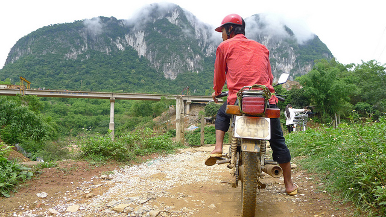
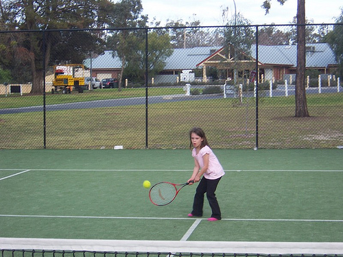
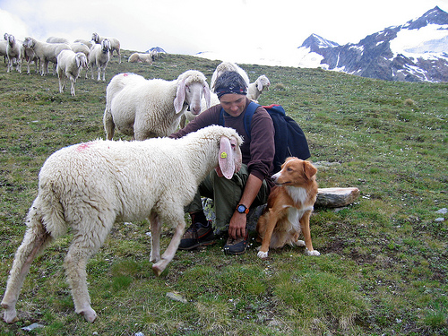
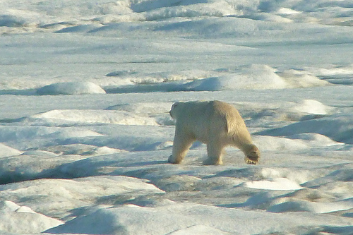
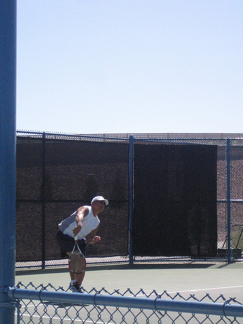

# KLaVA VLM 학습 데이터셋 정리

샘플 이미지는 AI Hub의 license상 재배포가 불가하여 첨부하지 않습니다.

## Stage 1: 이미지-캡션 정렬 학습
- connector만 학습하고 LM과 비전 인코더는 freeze.
- 스키마: `{image, caption, image_id, source, caption_idx}`.
- 데이터셋의 train/val split을 모두 병합.
- 한글 미포함, 8자 미만 필터링.

| 소스 | 데이터셋 | 종류 | 행 수 | 비율 | 비고 |
|---|---|---|---:|---:|---|
| `mscoco_ko` | MSCOCO 2014 train/val 한국어 캡션 | 일반 이미지 캡션(번역) | 616,759 | 73.45% | 이미지당 한국어 캡션 5개 explode |
| `kvu_71866` | AI Hub 한국적 영상 이해 (71866) | 한국 문화, 장면 캡션 | 183,854 | 21.90% | 이미지당 한국어 캡션 5개 explode |
| `ekvqa_71357` | AI Hub 외부 지식 멀티모달 QA (71357) | 장면 묘사 캡션 | 26,812 | 3.19% | 이미지당 1캡션. Stage 2와 이미지 절반씩 분할 |
| `korean_gqa_71711` | AI Hub 한국형 GQA (71711) | 장면 묘사 캡션 | 12,266 | 1.46% | 일부 이미지의 캡션 |
| **합계** | | | **839,691** | **100%** | |

### 샘플
**`mscoco_ko`** — 이미지 캡션(번역)

> **caption:** 빨간 헬멧을 쓴 남자가 작은 모터 달린 비포장 도로를 달려 있다.

**`kvu_71866`** — 한국 문화, 장면 캡션

<!--  -->
> **caption:** 흰색 컨테이너 벽으로 둘러싸인 이곳은 작업을 위해 실내에 별도로 마련된 공간입니다.

**`ekvqa_71357`** — 장면 묘사 캡션

<!--  -->
> **caption:** 두 명의 사람이 빵집에 진열된 프레첼 앞에 서 있다.

**`korean_gqa_71711`** — 장면 묘사 캡션

<!--  -->
> **caption:** 붉은색 방석이 놓여 있고 주먹을 쥐고 있는 사람 모형이 세워져 있다.

## Stage 2: 지시 학습
- LM LoRA(r=64, alpha=128), connector, 비전 인코더를 학습하고 LM은 freeze.
- 스키마: LLaVA식 `{id, image?, source, conversations:[{from, value}]}`. 추론 행은 `reasoning:true`와 gpt 턴의 `think`(CoT) 필드를 추가로 가진다.
- 한국어 멀티모달을 주축으로 망각 방지를 위해 한국어/영어 text, 멀티모달 리플레이를 혼합.
- 문서, OCR, 차트, 표 등의 데이터는 총합 30%의 비율로 균형화.
- 추론(CoT) 행은 EXAONE 추론 모드(`<think>\n{CoT}\n</think>\n\n{답변}`)로 렌더링하고 CoT와 답변을 supervise
- 아래 표에서 `synth_*`와 `vlmgen*`은 뒤에 추가된 합성 보강분이다. 원 데이터에 없던 네 가지 능력을 겨냥한다.
    - 구조 판독: 표/차트의 헤더-셀 결합 밀림을 교정하는 결정론 생성 QA(`synth_*_struct_*`).
    - 근거 거부: 이미지에 없는 행/열/계열을 물었을 때 지어내지 않고 없다고 답하는 학습.
    - 라우터 유형 분류: 문서/표/차트/사진 네 단어 중 하나로만 답하는 과제(`vlmgen_trackc_*`).
    - crop 판독과 zoom 그라운딩: 잘린 영역을 읽거나, 작아서 확신할 수 없는 대상의 bbox를 정규화 좌표로 제시하며 확대를 권하는 응답(`vlmgen_aihub_ocr_71730`, `zoom_target_natural`).

| 소스 | 데이터셋 | 종류 | 행 수 | 비율 | 비고 |
|---|---|---|---:|---:|---|
| `coco` | KoLLaVA-v1.5-instruct (COCO) | 한국어 멀티모달 대화/추론 | 362,948 | 24.85% | - |
| `vg` | KoLLaVA-v1.5-instruct (Visual Genome) | 한국어 region grounding | 86,417 | 5.92% | - |
| `gqa` | KoLLaVA-v1.5-instruct (GQA) | 한국어 단답 VQA | 72,140 | 4.94% | 첫 human 턴 `<Answer>` 아티팩트 제거 |
| `korean_gqa_71711` | AI Hub 한국형 GQA (71711) | 한국어 VQA(관계/속성) | 145,902 | 9.99% | 이미지의 VQA(첫+마지막 QA) |
| `ekvqa_71357` | AI Hub 외부 지식 멀티모달 QA (71357) | 한국어 VQA | 53,626 | 3.67% | Stage 1와 이미지 절반 분할 |
| `ocr_ke_71730` | AI Hub 다중 언어 OCR (71730, KE만) | 한국어 OCR 전사 | 106,515 | 7.29% | - |
| `chart_71706` | AI Hub 차트 이미지-텍스트 (71706) | 차트 설명/요약/제목/범례 | 106,515 | 7.29% | - |
| `table_71709` | AI Hub 표 이미지-텍스트 (71709) | 표 설명/요약/제목/구조 | 106,508 | 7.29% | - |
| `vizqa_71812` | AI Hub 시각화 자료 QA (71812) | 차트/표 시각화 QA/설명 | 103,190 | 7.07% | - |
| `ko_text_replay` | 한국어 text-only SFT | 한국어 텍스트 리플레이 | 99,523 | 6.81% | `alpaca_gpt4_ko`, `koalpaca_realqa`, `qarv_ko_mt`의 답변을 EXAONE-4.0-1.2B로 재생성. |
| `en_replay` | LLaVA-1.5 영어 mix | 영어 멀티모달 리플레이(region/grounding) | 183,934 | 12.59% | - |
| `ko_cot_reasoning` | 합성 데이터 | 한국어 텍스트 CoT 추론 | 2,472 | 0.17% | 10개 추론 카테고리. `<think>` 추론+답변 supervise |
| `ko_vcot_reasoning` | 합성 데이터 | 한국어 시각 CoT 추론 | 766 | 0.05% | Stage 2 이미지 근거 시각 추론. 이미지+`<think>` supervise |
| `synth_table_struct_v2` | 합성 데이터 (AI Hub 71709 이미지) | 표 구조 판독 QA | 4,872 | 0.33% | 표 998장. 8개 과제 유형(셀 조회, 행 낭독, 역질의, 열 극값, 오류 정정, 없는 행/열 거부) |
| `synth_chart_struct_v2` | 합성 데이터 (AI Hub 71706 이미지) | 차트 구조 판독 QA | 4,554 | 0.31% | 차트 998장. 8개 과제 유형(단일/다중 셀 조회, 계열 낭독, 비교, 비교+산술, 극값, 근거 거부) |
| `synth_table_struct_v1`, `synth_chart_struct_v1` | 합성 데이터 파일럿 | 표/차트 구조 판독 QA | 301 | 0.02% | v2 이전 파일럿(표 127, 차트 174). 이미지 48장은 v2와 disjoint |
| `vlmgen_aihub_causal_reasoning_10` | 합성 데이터 (AI Hub 자연 이미지) | 한국어 자연 이미지 지시(인과/예측) | 2,551 | 0.17% | 이미지당 1행. 9개 과제 유형 공통 |
| `vlmgen_aihub_visual_commonsense_08` | 합성 데이터 (AI Hub 자연 이미지) | 한국어 자연 이미지 지시(시각 상식) | 2,549 | 0.17% | 이미지당 1행. 9개 과제 유형 공통 |
| `vlmgen_aihub_category_reasoning_11` | 합성 데이터 (AI Hub 자연 이미지) | 한국어 자연 이미지 지시(범주 판단) | 2,463 | 0.17% | 이미지당 1행. 9개 과제 유형 공통 |
| `vlmgen_aihub_ocr_71730` | 합성 데이터 (AI Hub 71730 이미지) | crop 판독 / zoom 그라운딩 | 1,636 | 0.11% | `crop_read` 900(잘린 영역 읽기), `zoom_target` 736(근거 bbox 제시) |
| `vlmgen_trackc_*` | 합성 데이터 (7종 이미지 풀) | 이미지 유형 분류(라우터) | 1,197 | 0.08% | 문서 318, 표 300, 사진 295, 차트 284로 균형. 답은 네 단어 중 하나 |
| `vlmgen2_clevr_ko` | CLEVR류 합성 장면 | 한국어 속성/위치 그라운딩 | 9,829 | 0.67% | 이미지당 1행. 색/재질/크기/모양과 좌우 배치를 답하고 근거 단서를 함께 서술 |
| **합계** | | | **1,460,408** | **100%** | |

`vlmgen_aihub_*` 자연 이미지 3종이 공유하는 9개 과제 유형: `grounded_reasoning`(근거 기반 추론), `detailed_description`(상세 묘사), `attribute_commonsense`(속성/재질 상식), `honesty_uncertainty`(모르는 것은 모른다고 답하기), `zoom_target_natural`(작아서 불확실한 대상의 bbox 제시 후 확대 권유), `fine_detail_qa`(세부 디테일 QA), `short_factual`(단답 사실 확인), `causal_prediction`(인과 예측), `counting_comparison`(개수 세기/비교).

`vlmgen_trackc_*`의 7종 이미지 풀: `photo_pool`(자연 사진) 200, `table_71709` 300, `chart_71706` 250, `vizqa_pdf_render` 269, `vizqa_png` 34, `ocr_scene` 95, `ocr_ct` 49.

### 샘플
**`coco`** — 한국어 멀티모달 대화/추론

> **Q:** 이 어린 소녀가 테니스를 통해 얻을 수 있는 이점은 무엇일까요?
> **A:** 이미지 속 소녀는 테니스를 통해 다양한 신체적, 정신적, 사회적 이점을 얻을 수 있습니다. 신체적으로 테니스는 전신 운동을 제공하여 심혈관 건강, 근력, 유연성, 조정력 및 균형 감각을 향상시킵니다. 어린 나이에 테니스와 같은 스포츠에 참여하면 건강한 습관과 신체 활동에 대한 애정을 형성하여 전반적인 건강과 웰빙을 유지하는 데 도움이 될 수 있습니다. 정신적으로도 테니스는 경기 중 상황에 따라 다양한 대응을 요구하기 때문에 집중력, 문제 해결력, 적응력을 키울 수 있습니다. 테니스를 통해 발달한 이러한 인지 능력은 학업이나 대인 관계 등 삶의 다른 측면에도 긍정적인 영향을 미칠 수 있습니다. 또한 테니스를 통해 다른 선수, 코치, 동호인들과 친구를 사귀고 관계를 맺으며 동지애와 스포츠맨십을 키울 수 있기 때문에 사회적 이점도 얻을 수 있습니다.

**`vg`** — 한국어 region grounding

> **Q:** 이 영역에 대해 간단히 설명해주세요: [0.28, 0.23, 0.36, 0.27].
> **A:** 잔디에 누워있는 양.

**`gqa`** — 한국어 단답 VQA

> **Q:** 땅은 무엇으로 덮여 있나요? 한 단어나 구를 사용하여 질문에 답하세요.
> **A:** 눈

**`korean_gqa_71711`** — 한국어 관계/속성 VQA

<!--  -->
> **Q:** 사진에 대해 전체적으로 설명해 주세요.
> **A:** 의자는 자동차와 에스컬레이터보다 크기가 작다.

**`ekvqa_71357`** — 한국어 VQA

<!--  -->
> **Q:** 이미지 안의 코끼리의 다리에 둘러진 것은 뭐지
> **A:** 사슬

**`en_replay`** — 영어 멀티모달 리플레이

> **Q:** What the person wearing visor? Answer the question using a single word or phrase.
> **A:** Yes

**`ocr_ke_71730`** — 한국어 OCR 전사

<!--  -->
> **Q:** 이미지에 있는 모든 텍스트를 읽어 주세요.
> **A:** 대회의실\nConference\nRoom\n오성툴스\n주\nOsung\nTools

**`chart_71706`** — 한국어 차트 이해

<!--  -->
> **Q:** 차트의 수치를 포함해 내용을 설명해 주세요.
> **A:** 20대, 30대, 40대의 전통시장에대한 호감도를 나타낸 방사형 그래프이다. 전통시장에대한 호감도의 경우, 남을 살펴보면, 20대는 11%이고, 30대는 25%이고, 40대는 41%이다. 여를 살펴보면, 20대는 17%이고, 30대는 33%이고, 40대는 50%이다.

**`table_71709`** — 한국어 표 이해

<!--  -->
> **Q:** 이 표의 내용을 자세히 설명해 주세요.
> **A:** 1. 기후변화감시 및 예측은 기후변화를 감시하며 예측하는 능력을 강화하고, 이를 통해 제공되는 자료를 통해 기후변화에 대응하는 데 필요한 불확실성을 최소화할 수 있도록 하는 전략이다.  2. 적응산업/에너지는 기후변화에 적응하는 신사업을 발굴하고 이를 통해 효율적인 에너지 사용을 도모하는 전략이다.  3. 교육, 홍보 및 국제협력은 교육과 홍보를 통해 기후변화에 대한 인식을 향상시키고, 국제적인 협력을 통해 대응 능력을 강화하는 전략이다.

**`vizqa_71812`** — 한국어 시각화 QA

<!--  -->
> **Q:** 이미지에 있는 표의 내용을 설명해 주세요.
> **A:** 2016년 기준 직업 대분류별 취업자 수 전망에 대한 표입니다. 2016년 전체 취업자는 26,235천 명 중 사무종사자는 4,519천 명입니다.

**`ko_text_replay`** — 한국어 텍스트

> **Q:** 바나나로 할 수 있는 창의적인 것을 한 가지만 알려줘.
> **A:** 바나나로 다양한 창의적인 아이디어를 만들 수 있어요! 몇 가지 예시를 알려드릴게요:\n\n1. **바나나 스무디 볼** — 바나나에 우유, 꿀, 과일 주스를 넣어 영양 가득한 아침 식사로 활용하세요.\n2. **바나나 에너지 바** — 설탕 대신 천연 감미료(꿀이나 메이플 시럽)와 프로틴 파우더를 섞어 건강 간식으로 만들 수 있습니다. …

**`ko_cot_reasoning`** — 한국어 텍스트 CoT 추론 (`<think>` supervise)

> **Q:** 10진수 45를 5진법으로 나타내면 얼마인가?
> **\<think\>:** 1) 45를 5로 나누면 몫 9, 나머지 0이다. 2) 몫 9를 다시 5로 나누면 몫 1, 나머지 4이다. 3) 몫 1을 다시 5로 나누면 몫 0, 나머지 1이다. 4) 나머지를 아래에서부터 위로 읽으면 1,4,0이므로 45는 5진법으로 140이다.
> **A:** 140(5진수)

**`ko_vcot_reasoning`** — 한국어 시각 CoT 추론 (이미지 근거 `<think>` supervise)

<!--  -->
> **Q:** 이 설문에서 법을 '잘 모른다'거나 '들어본 적만 있다'고 답한 비율의 합은 얼마이며, 이는 '매우 잘 안다'는 응답의 몇 배인가?
> **\<think\>:** 1) 원그래프를 보면 짙은 초록색 '잘 모른다'는 11%, 밝은 초록색 '들어본 적은 있다'는 57%, 빨간색 '매우 잘 안다'는 32%로 나뉘어 있다. 2) '잘 모른다'와 '들어본 적은 있다'를 더하면 11+57=68%가 된다. 3) '매우 잘 안다'는 32%이므로 68을 32로 나누면 약 2.125, 즉 약 2.1배가 된다.
> **A:** 68%이며, 이는 '매우 잘 안다'는 응답(32%)의 약 2.1배이다.

## 출처 정리
- **AI Hub**: 71866(한국적 영상 이해), 71357(외부지식 멀티모달 QA), 71711(한국형 GQA), 71706(차트), 71709(표), 71812(시각화 자료 QA), 71730(다중 언어 OCR, KE 한국어만 채택), MSCOCO 한국어 캡션.
- **KoLLaVA-v1.5-mix(581k)**: COCO/VG/GQA 등 LLaVA-1.5 믹스의 한국어 번역본 (`coco`/`vg`/`gqa`).
- **영어 리플레이(`en_replay`)**: LLaVA-1.5 영어 원본 일부(grounding/region), 영어 능력 망각 방지.
- **한국어 텍스트 리플레이(`ko_text_replay`)**: 한국어 text-only SFT, 언어 능력 망각 방지. 원래 분포의 정합을 위해 `alpaca_gpt4_ko`, `koalpaca_realqa`, `qarv_ko_mt`의 답변을 EXAONE-4.0-1.2B로 재생성.
- **추론 트랙(`ko_cot_reasoning`/`ko_vcot_reasoning`)**: 합성 CoT 데이터. 텍스트 CoT는 10개 추론 카테고리(수학/논리/상식/비교/계획/인과/독해/과학/문장제/판단), 시각 CoT는 Stage 2 이미지(chart/table/vizqa/coco/korean_gqa)를 직접 관찰해 이미지 근거로 다단계 추론 후 답을 도출한다.
- **구조 판독 합성(`synth_*_struct_*`)**: AI Hub 71706(차트), 71709(표)의 원본 이미지와 라벨 JSON을 질문 템플릿 라이브러리로 결정론적으로 인스턴스화. 표/차트의 헤더-셀 결합 밀림 교정이 목적이며, 이미지 대조 2라운드 검증을 거쳤다. 원본은 `data/vlm/synth_struct/`.
- **에이전트 생성 트랙(`vlmgen_*`)**: 에이전트 파이프라인으로 생성한 한국어 지시 데이터. 자연 이미지 3종(`08`/`10`/`11`)은 AI Hub 자연 이미지 풀에서, `vlmgen_aihub_ocr_71730`은 71730 OCR 이미지의 crop에서, `vlmgen_trackc_*`은 문서/표/차트/사진 네 유형의 이미지 풀에서 만들었다. 에이전트 그래프의 라우터 유형 분류, supervisor의 재판독 요청, 시각적 불확실성 거부를 KLaVA가 직접 수행하도록 겨냥한 보강분이다.
- **CLEVR 그라운딩(`vlmgen2_clevr_ko`)**: CLEVR류 합성 장면에 색/재질/크기/모양과 좌우 배치를 한국어로 묻는 QA. 답에 판단 근거(색, 윤곽, 배치)를 함께 쓰도록 강제해 이미지 밖 추측을 억제한다.