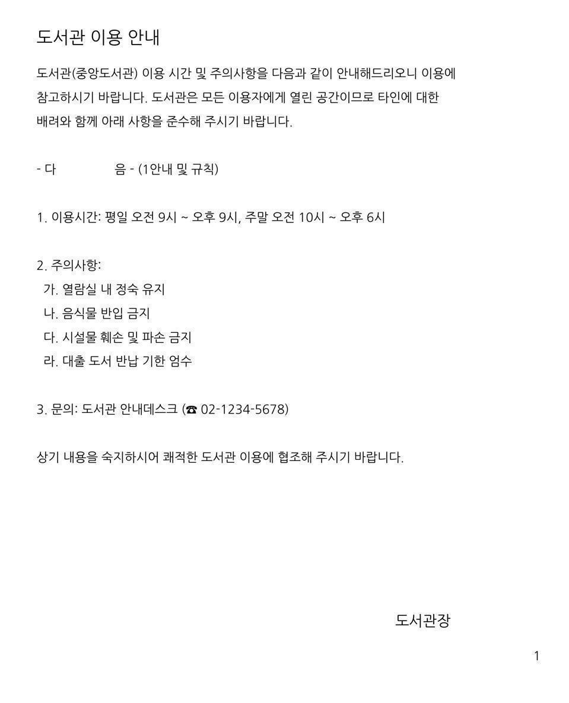
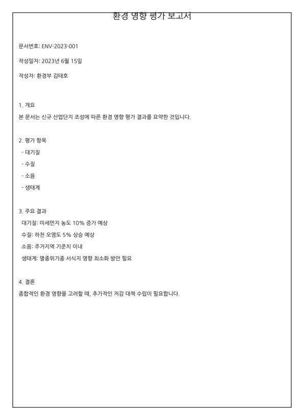
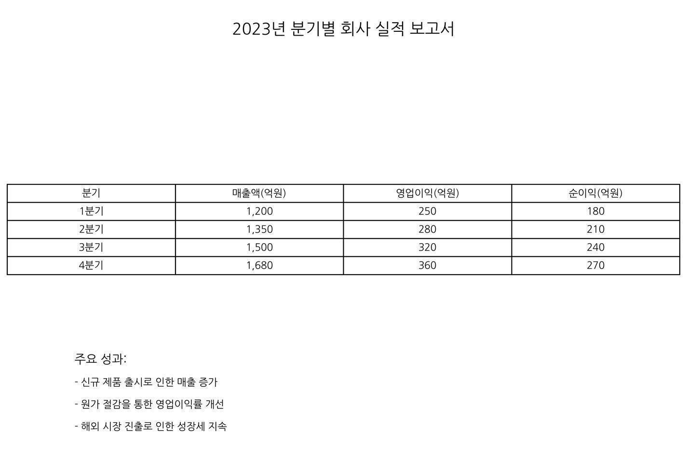
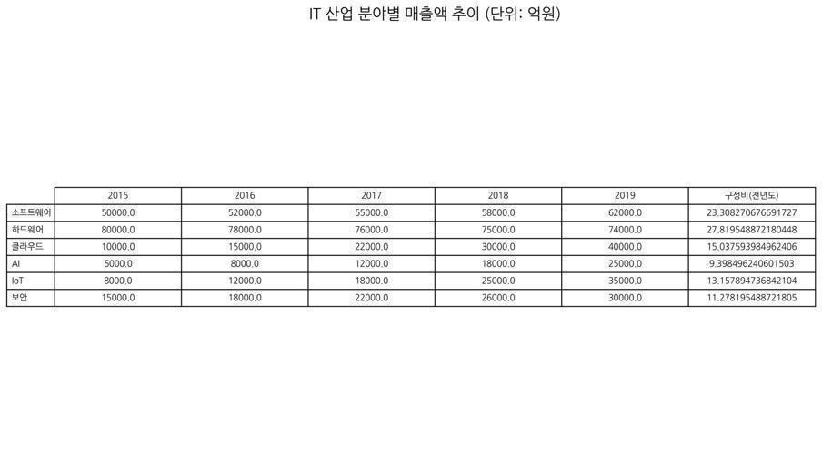
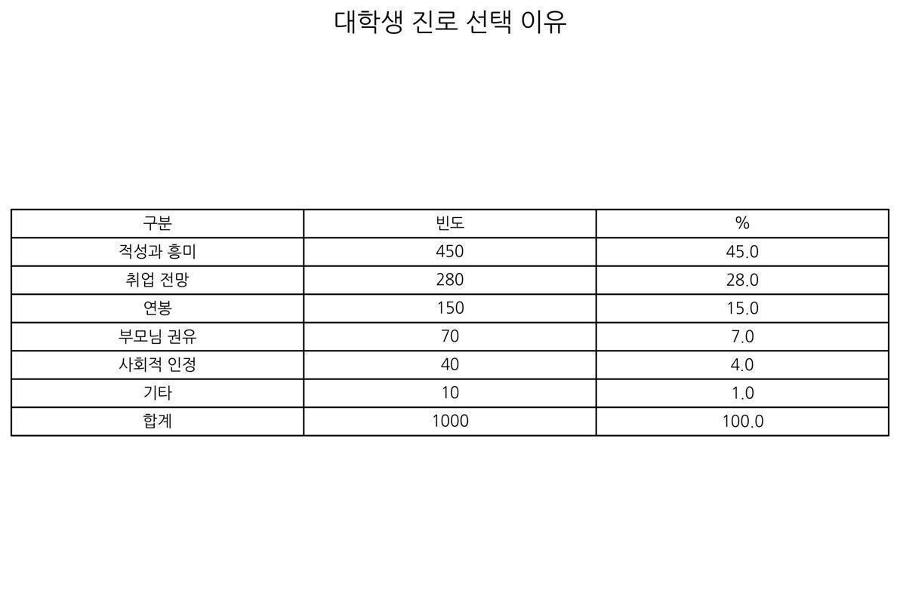
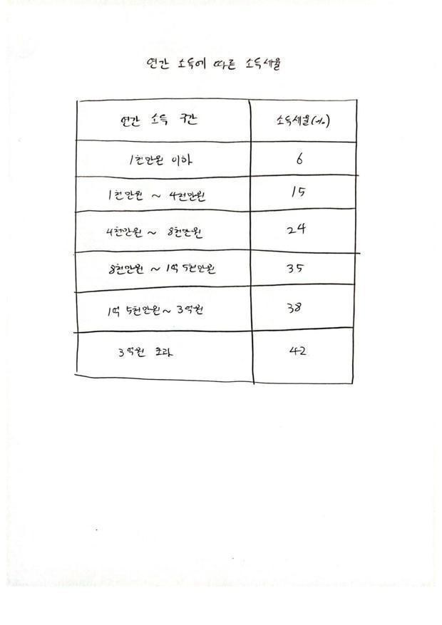
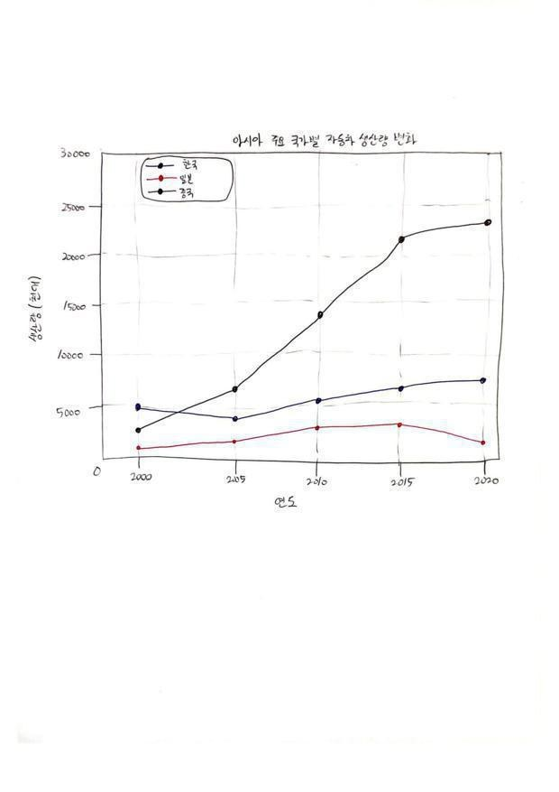
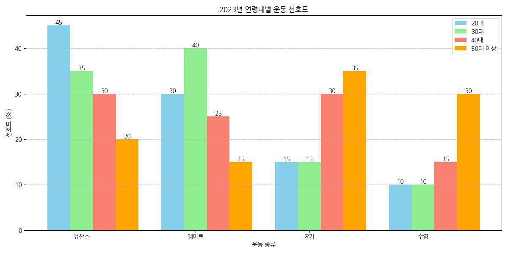
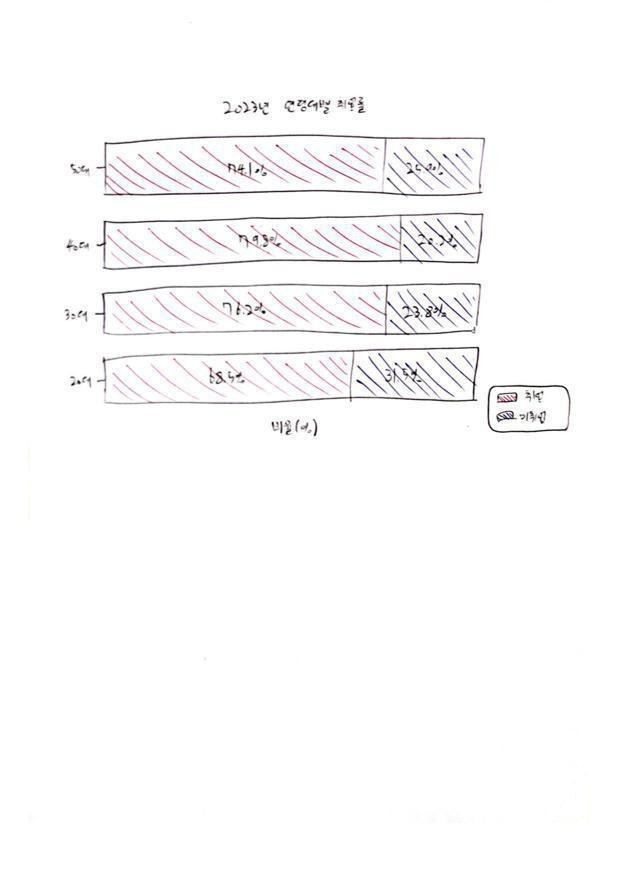

# KLaVA-576-r64 평가 보고서

## 1. 정량 벤치마크 비교

- MCQ 8종(K-MMBench, K-MMStar, K-SEED, K-DTCBench, MMBench-EN, MMStar, SEED-IMG, ScienceQA) + 전 모델 동일하게 Sonnet 5를 정답 추출기(judge)로 사용.
- GQA, POPE, MME, TextVQA는 규칙 기반(exact-match, yes/no).

| 모델 | K-MMBench | K-MMStar | K-SEED | K-DTCBench | MMBench-EN | MMStar | SEED-IMG | ScienceQA | GQA | POPE | MME | TextVQA |
|---|--:|--:|--:|--:|--:|--:|--:|--:|--:|--:|--:|--:|
| KLaVA (1.8B) | 64.3 | 42.7 | 74.0 | 44.6 | 67.4 | 40.2 | 70.9 | 61.4 | 58.9 | 86.1 | 1517.5 | 47.6 |
| VARCO-VISION-2.0 (1.7B) | 70.4 | 51.0 | 72.3 | 68.8 | 76.8 | 54.7 | 74.5 | 83.9 | 51.9 | 88.6 | 1786.7 | 78.2 |
| Qwen2.5-VL-Instruct (3B) | 72.3 | 50.1 | 72.2 | 82.1 | 79.7 | 56.9 | 73.8 | 81.6 | 58.8 | 86.2 | 2166.9 | 81.0 |
| InternVL3 (2B) | 69.2 | 51.8 | 68.7 | 67.9 | 80.7 | 60.5 | 74.7 | 95.8 | 51.3 | 90.0 | 2127.0 | 79.0 |
| Kanana-1.5-V (3B) | 72.4 | 49.3 | 74.6 | 87.5 | 76.3 | 53.7 | 73.2 | 95.9 | 15.4† | 86.0 | 1980.0 | 78.0 |

- 지표: MME는 perception + cognition 원점수 합(만점 2800), POPE는 Overall F1, 그 외는 정확도(%). K/한국어 계열은 한국어 벤치.
- `†` Kanana GQA 15.4는 성능이 아니라 포맷 이상치다. GQA는 judge 없는 exact-match VQA인데 Kanana의 서술형 출력이 단답 정규화와 맞지 않아 나온 값이라 해석에서 제외한다(다른 벤치는 judge 추출 또는 규칙 채점으로 정상화됨).

### 관찰

- **동급 베이스라인들과 격차.** 시각 이해 **K-SEED 74.0**은 KANANA(74.6)에 근접, 관계추론 **GQA 58.9는 Qwen(58.8)과 동급 최상위권**이고 VARCO, InternVL3(51~52)보다 높다. SEED-IMG 70.9는 3B 모델들(68~75)에 근접하며, 환각 억제 POPE 86.1도 경쟁력 있다.
- **최대 약점은 K-DTCBench 44.6**(문서, 표, 차트 미세 판독). 3B 모델들(68~88)과 격차가 크다. 이 판독 병목은 KAVA 에이전트로 보완한다.
- **지식 의존 계열** ScienceQA 61.4, MME 1517.5은 3B 모델보다 가진 지식이 적다.

---

## 2. 자연이미지 정성 비교 (KLaVA)

### `image1.jpg`: ELLE STYLE AWARDS 포토월(양복 남성, 드레스 여성)

<!--  -->

**프롬프트: “양복을 입은 남자가 무엇을 하고 있나요?”**

| 모델 | 응답(원문) |
|---|---|
| KLaVA-784-r64 | 양복을 입은 남자가 여자 옆에서 있습니다. |
| KLaVA-784-full | 양복을 입은 남자가 여성 옆에 서서 사진을 찍기 위해 포즈를 취하고 있습니다. |
| KLaVA-576-r64 | 양복을 입은 남자는 드레스를 입은 여성 옆에서 있습니다. |
| KLaVA AxisMF | 사진을 찍고 있다. |

### `image2.jpg`: 도시 야경 큰 창이 있는 현대식 침실

<!--  -->

**프롬프트: “이미지에서 큰 창 반대편에는 무엇이 있습니까?”**

| 모델 | 응답(원문) |
|---|---|
| KLaVA-784-r64 | 이미지에서 큰 창문 반대편에는 텔레비전이 있습니다. |
| KLaVA-784-full | 이미지에서 큰 창 반대편에는 도시가 보입니다. |
| KLaVA-576-r64 | 이미지에서 큰 창문 반대편에는 화분이 있습니다. |
| KLaVA AxisMF | 이미지에서 큰 창문 반대편에는 텔레비전이 있습니다. |

### `image3.jpg`: 선글라스와 구명조끼를 착용하고 서핑하는 강아지

<!--  -->

**프롬프트: “바다에서 서핑 보드를 타고 있는 것은 무엇입니까?”**

| 모델 | 응답(원문) |
|---|---|
| KLaVA-784-r64 | 개 |
| KLaVA-784-full | 개 |
| KLaVA-576-r64 | 개 |
| KLaVA AxisMF | 개가 바다에서 서핑 보드를 타고 있습니다. |

### `image4.jpg`: 도로에서 전복되는 트럭(블랙박스풍)

<!--  -->

**프롬프트: “다음에 어떤 일이 일어날까?”**

| 모델 | 응답(원문) |
|---|---|
| KLaVA-784-r64 | 이미지에서 트럭이 도로에서 뒤집혀 있고, 트럭의 바퀴가 도로를 가로질러 떨어져 있습니다. 이 상황은 트럭이 사고나 기계적 고장으로 인해 발생했을 수 있음을 시사합니다. 트럭이 뒤집히면 트럭의 운전자와 승객이 부상을 입을 수 있으며, 트럭의 바퀴가 도로를 가로질러 떨어져 차량이 손상될 수 있습니다. 또한 트럭이 뒤집히면 도로에 있는 다른 차량이 충돌하거나 손상될 수 있습니다. 이러한 사고는 운전자와 승객의 안전을 보장하고 도로의 다른 차량과 보행자에게 잠재적인 위험을 초래할 수 있으므로 사고를 예방하고 안전한 운전을 유지하기 위해 적절한 안전 조치를 취하는 것이 중요합니다. |
| KLaVA-784-full | 이미지에서 트럭이 도로를 주행하다가 도로를 벗어나고 있습니다. 트럭이 도로를 벗어나면 트럭 운전자와 다른 도로 이용자 모두에게 잠재적인 위험이 발생할 수 있습니다. 운전자는 트럭이 도로를 벗어나면 안전하게 도로를 빠져나갈 수 있도록 주의를 기울이고 속도를 줄여야 합니다. 다른 도로 이용자도 트럭의 움직임에 주의를 기울이고 트럭이 도로를 벗어나면 안전하게 도로를 빠져나갈 수 있도록 준비해야 합니다. 또한 트럭 운전자는 사고를 피하기 위해 트럭의 경로를 변경하거나 다른 차량과의 충돌을 피하기 위해 차선을 변경해야 할 수도 있습니다. |
| KLaVA-576-r64 | 이미지에서 트럭이 도로를 주행하다가 급회전을 하다가 균형을 잃고 뒤집히는 사고가 발생했습니다. 이 사고는 트럭이 도로를 주행하는 동안 트럭의 균형을 잃고 뒤집히는 것으로 묘사되어 있습니다. 이로 인해 트럭이 뒤집히고 도로에 있는 다른 차량과 보행자에게 위험을 초래할 수 있습니다. 이 사고는 트럭 운전자와 다른 도로 이용자의 안전을 보장하기 위해 적절한 안전 조치를 취하고, 교통 규칙을 준수하며, 사고 발생 시 신속하게 대응하는 것이 중요하다는 것을 강조합니다. |
| KLaVA AxisMF | 이미지에서 자동차가 도로를 주행하는 동안 트럭이 도로를 막고 있습니다. 트럭이 도로를 막고 있기 때문에 트럭이 완전히 통과하거나 트럭이 도로를 막고 있는 차량을 통과하는 것을 방지하기 위해 운전자가 주의를 기울여야 합니다. 트럭이 완전히 통과하거나 운전자가 도로를 막고 있는 차량을 통과하는 것을 방지하기 위해 운전자는 주의를 기울이고 속도를 줄이며 필요한 경우 차간 거리를 늘려야 합니다. 또한 트럭이 완전히 통과하거나 운전자가 도로를 막고 있는 차량을 통과하는 것을 방지하기 위해 트럭 운전자는 도로를 막고 있는 차량에 주의를 기울여야 합니다. |

### `image5.jpg`: 웨딩 케이크를 자르는 신랑과 신부

<!--  -->

**프롬프트: “이 사진에 사람이 몇 명 있어?”**

| 모델 | 응답(원문) |
|---|---|
| KLaVA-784-r64 | 이 사진에는 신랑과 신부 두 사람이 있습니다. |
| KLaVA-784-full | 이 사진에는 신랑과 신부 두 사람이 있습니다. |
| KLaVA-576-r64 | 이 사진에는 신랑과 신부 두 사람이 있습니다. |
| KLaVA AxisMF | 이 사진에는 두 사람이 있습니다. |

**프롬프트: “가운데 두 남녀는 어떤 관계로 보여?”**

| 모델 | 응답(원문) |
|---|---|
| KLaVA-784-r64 | 이미지에서 신랑과 신부가 함께 케이크를 자르고 있는 것으로 보아 결혼식을 축하하는 커플임을 알 수 있습니다. 이는 그들이 결혼식을 축하하는 커플이며, 그들의 관계는 부부 관계임을 나타냅니다. |
| KLaVA-784-full | 이미지에서 신랑과 신부가 함께 웨딩 케이크를 자르고 있는 것으로 보아 결혼한 것으로 보입니다. |
| KLaVA-576-r64 | 이미지에서 한 남성과 여성이 웨딩 케이크를 자르고 있는 것으로 보아 결혼한 것으로 보입니다. 이는 두 사람이 결혼식을 축하하는 커플임을 암시합니다. |
| KLaVA AxisMF | 사진 속 가운데 두 남자는 서로의 손을 잡고 있는 것으로 보아 연인 관계로 보입니다. |

**프롬프트: “사진이 촬영된 장소는”**

| 모델 | 응답(원문) |
|---|---|
| KLaVA-784-r64 | 결혼식 |
| KLaVA-784-full | 웨딩 케이크 |
| KLaVA-576-r64 | 결혼식 |
| KLaVA AxisMF | 무도장 |

**프롬프트: “식탁 위에 뭐가 있어?”**

| 모델 | 응답(원문) |
|---|---|
| KLaVA-784-r64 | 결혼식 케이크가 식탁 위에 놓여 있습니다. |
| KLaVA-784-full | 식탁 위에 웨딩 케이크가 있습니다. |
| KLaVA-576-r64 | 식탁 위에 웨딩 케이크가 있습니다. |
| KLaVA AxisMF | 케이크 |

### `image6.jpg`: 주방에서 피자를 오븐에 다루는 남성

<!--  -->

**프롬프트: “이 사진에 사람이 몇 명 있어?”**

| 모델 | 응답(원문) |
|---|---|
| KLaVA-784-r64 | 이 사진에는 한 사람이 있습니다. |
| KLaVA-784-full | 이 사진에는 한 사람만 있습니다. |
| KLaVA-576-r64 | 이 사진에는 한 사람만 있습니다. |
| KLaVA AxisMF | 이 사진에는 두 사람이 있습니다. |

**프롬프트: “사진 속의 사람은 무엇을 하고 있어?”**

| 모델 | 응답(원문) |
|---|---|
| KLaVA-784-r64 | 사진 속 사람은 피자를 오븐에 넣고 있습니다. |
| KLaVA-784-full | 사진 속 사람은 오븐에서 피자를 꺼내고 있습니다. |
| KLaVA-576-r64 | 사진 속 사람은 피자를 오븐에 넣고 있습니다. |
| KLaVA AxisMF | 사진 속의 사람은 오븐에서 피자를 꺼내고 있습니다. |

**프롬프트: “사진이 촬영된 장소는?”**

| 모델 | 응답(원문) |
|---|---|
| KLaVA-784-r64 | 사진이 촬영된 장소는 주방입니다. |
| KLaVA-784-full | 사진이 촬영된 장소는 주방입니다. |
| KLaVA-576-r64 | 사진이 촬영된 장소는 주방입니다. |
| KLaVA AxisMF | 사진이 촬영된 장소는 주방입니다. |

**프롬프트: “사람이 들고 있는 것이 뭐야?”**

| 모델 | 응답(원문) |
|---|---|
| KLaVA-784-r64 | 사람이 피자 한 판을 들고 있습니다. |
| KLaVA-784-full | 사람이 피자 한 조각을 들고 있습니다. |
| KLaVA-576-r64 | 사람이 피자를 들고 있습니다. |
| KLaVA AxisMF | 피자 |

**프롬프트: “사진 속 사람은 무슨 색의 어떤 옷을 입고 있어?”**

| 모델 | 응답(원문) |
|---|---|
| KLaVA-784-r64 | 사진 속 사람은 검은색 옷을 입고 있습니다. |
| KLaVA-784-full | 사진 속 사람은 검은색 옷을 입고 있습니다. |
| KLaVA-576-r64 | 사진 속 사람은 검은색 옷을 입고 있습니다. |
| KLaVA AxisMF | 검은색 |

### `image7.jpeg`: 실내 마룻바닥의 흰색 스피츠 강아지

<!--  -->

**프롬프트: “이 이미지에 대해 묘사해주세요.”**

| 모델 | 응답(원문) |
|---|---|
| KLaVA-784-r64 | 하얀 개가 바닥에 누워 있습니다. |
| KLaVA-784-full | 하얀 개가 바닥에 누워 있습니다. |
| KLaVA-576-r64 | 하얀색 개가 의자와 쓰레기통보다 낮은 곳에 있습니다. |
| KLaVA AxisMF | 하얀색 개가 문 앞에 있습니다. |

**프롬프트: “이 사진이 촬영된 장소는 어디인가요?”**

| 모델 | 응답(원문) |
|---|---|
| KLaVA-784-r64 | 사진 속 장소는 실내이며, 개가 소파와 의자 근처 바닥에 누워 있습니다. |
| KLaVA-784-full | 이 사진이 촬영된 장소는 실내입니다. |
| KLaVA-576-r64 | 이 사진이 촬영된 장소는 실내입니다. |
| KLaVA AxisMF | 이 사진은 거실에서 촬영되었습니다. |

### `image8.jpg`: 야구 경기(마운드 위 투수, 뒤편 검정옷 심판)

<!--  -->

**프롬프트: “사진 속의 장소는 어디야?”**

| 모델 | 응답(원문) |
|---|---|
| KLaVA-784-r64 | 사진 속의 장소는 야구장입니다. |
| KLaVA-784-full | 사진 속 장소는 야구장입니다. |
| KLaVA-576-r64 | 사진 속의 장소는 야구장입니다. |
| KLaVA AxisMF | 사진 속의 장소는 야구장입니다. |

**프롬프트: “마운드 위의 사람은 누구지?”**

| 모델 | 응답(원문) |
|---|---|
| KLaVA-784-r64 | 투수 |
| KLaVA-784-full | 마운드 위의 사람은 투수입니다. |
| KLaVA-576-r64 | 야구 선수가 투수로서 공을 던지고 있습니다. |
| KLaVA AxisMF | 심판 |

**프롬프트: “투수 뒤로 보이는 검정색 옷을 입은 사람은 누구야?”**

| 모델 | 응답(원문) |
|---|---|
| KLaVA-784-r64 | 투수 뒤에 보이는 사람은 심판입니다. |
| KLaVA-784-full | 투수 뒤에 있는 사람은 심판입니다. |
| KLaVA-576-r64 | 투수 뒤에 있는 사람은 심판입니다. |
| KLaVA AxisMF | 투수 뒤에 보이는 검은색 옷을 입은 사람은 심판입니다. |

### `image9.jpg`: 밥, 국, 생선구이, 브로콜리가 있는 한 상 차림

<!--  -->

**프롬프트: “사진에서 브로콜리가 어디에 있어?”**

| 모델 | 응답(원문) |
|---|---|
| KLaVA-784-r64 | 브로콜리는 테이블 위에 놓인 그릇에 담겨 있습니다. |
| KLaVA-784-full | 브로콜리는 테이블 위에 있는 그릇에 담겨 있습니다. |
| KLaVA-576-r64 | 브로콜리는 식탁 위에 있는 접시에 담겨 있습니다. |
| KLaVA AxisMF | 사진에서 브로콜리는 접시 위에 있습니다. |

### `image10.jpg`: 가을 공원에서 빨간 자전거를 탄 여성

<!--  -->

**프롬프트: “이 사진에 대해 상세하게 설명해줘.”**

| 모델 | 응답(원문) |
|---|---|
| KLaVA-784-r64 | 이 이미지에는 한 여성이 자전거를 타고 길을 내려가는 모습이 담겨 있습니다. 그녀는 자전거를 타고 있는 동안 선글라스를 착용하고 있습니다. 자전거는 도로를 따라 길게 뻗어 있고, 여성은 자전거를 타고 있는 동안 균형을 유지하고 있습니다.배경에는 공원의 벤치가 여러 개 있는데, 일부는 여성과 가깝고 다른 벤치는 멀리 떨어져 있습니다. 이 장면은 여성이 자전거를 타고 공원을 즐기는 여유로운 하루를 묘사합니다. |
| KLaVA-784-full | 이 이미지는 한 여성이 자전거를 타고 길을 달리는 모습을 보여줍니다. 그녀는 선글라스를 착용하고 있으며, 자전거를 타는 동안 재킷을 입고 있습니다. 자전거는 길 한가운데에 위치하고 있으며, 여성은 자전거를 타고 있는 것처럼 보입니다.배경에는 공원에 있는 것으로 보이는 벤치가 있습니다. 또한 장면의 오른쪽에 또 다른 벤치가 있습니다. |
| KLaVA-576-r64 | 이 이미지에는 검은색 조끼를 입은 여성이 빨간색 자전거를 타고 있는 모습이 담겨 있습니다. 그녀는 공원에서 자전거를 타고 있으며, 배경에는 벤치가 여러 개 있습니다. 벤치 중 하나는 여성의 왼쪽에, 다른 벤치는 오른쪽에, 세 번째 벤치는 이미지의 오른쪽에 더 멀리 떨어져 있습니다. 자전거를 타는 여성은 공원에서 즐거운 시간을 보내고 있는 것으로 보입니다. |
| KLaVA AxisMF | 이 사진은 자전거를 타고 있는 사람의 모습을 보여줍니다. |

---

## 3. 한국어 문서, 표, 차트(K-DTCBench)

### `document_5` (문서)

<!--  -->

**질문:** 도서관 안내데스크의 전화번호 뒷자리로 올바른 것은?  
**정답:** `D) 5678`

| 모델 | 응답(원문) | 판정 |
|---|---|---|
| KLaVA-784-r64 | 02-1234-5678입니다. | 정답 |
| KLaVA-784-full | 02-1234-5678입니다. | 정답 |
| KLaVA-576-r64 | 올바른 전화번호는 568입니다. | 오답 |
| KLaVA AxisMF | 02-211-1111입니다. | 오답 |

### `document_20` (문서)

<!--  -->

**질문:** 보고서에서 하천 오염도를 어떻게 예상하고 있나요?  
**정답:** `A) 5% 상승`

| 모델 | 응답(원문) | 판정 |
|---|---|---|
| KLaVA-784-r64 | 하천 오염도는 10년 후 10% 증가할 것으로 예상하고 있습니다. | 오답 |
| KLaVA-784-full | 하천의 수질을 조사하여 예상하고 있습니다. | 오답 |
| KLaVA-576-r64 | 하천의 유입량을 고려하여 하천의 오염도를 예상합니다. | 오답 |
| KLaVA AxisMF | 하천의 오염도를 예상하고 있습니다. | 오답 |

### `document_41` (문서)

<!--  -->

**질문:** 회사의 1년 총 순이익은 얼마인가요?  
**정답:** `B) 900억원`

| 모델 | 응답(원문) | 판정 |
|---|---|---|
| KLaVA-784-r64 | 1,200억 원입니다. | 오답 |
| KLaVA-784-full | 1,200억 원입니다. | 오답 |
| KLaVA-576-r64 | 1,200억 원입니다. | 오답 |
| KLaVA AxisMF | 1,200억 원입니다. | 오답 |

### `table_3` (표)

<!--  -->

**질문:** 하드웨어 부문의 구성비(전년도)는 몇 퍼센트입니까? 단, 소수점 셋째자리에서 반올림하세요.  
**정답:** `B) 27.82%`

| 모델 | 응답(원문) | 판정 |
|---|---|---|
| KLaVA-784-r64 | 하드웨어 부문의 구성비(전년도)는 1.0%입니다. | 오답 |
| KLaVA-784-full | 하드웨어 부문의 구성비는 2015년 800.0%입니다. | 오답 |
| KLaVA-576-r64 | 하드웨어 부문의 구성비는 20.0%입니다. | 오답 |
| KLaVA AxisMF | 구성비는 1.5%입니다. | 오답 |

### `table_22` (표)

<!--  -->

**질문:** 대학생들이 진로를 선택한 가장 큰 이유는 무엇인가요?  
**정답:** `B) 적성과 흥미`

| 모델 | 응답(원문) | 판정 |
|---|---|---|
| KLaVA-784-r64 | 직업적 흥미가 가장 큰 이유입니다. | 부분 정답 |
| KLaVA-784-full | 가장 큰 이유는 적성과 흥미입니다. | 정답 |
| KLaVA-576-r64 | 진로에 대한 관심이 가장 큽니다. | 오답 |
| KLaVA AxisMF | 가장 큰 이유는 전공과의 관련성입니다. | 오답 |

### `table_50` (표)

<!--  -->

**질문:** 연간 소득이 1천만 원 이하인 경우 소득세율은 몇 퍼센트인가요?  
**정답:** `A) 6%`

| 모델 | 응답(원문) | 판정 |
|---|---|---|
| KLaVA-784-r64 | 소득세율은 15%입니다. | 오답 |
| KLaVA-784-full | 소득세율은 6%입니다. | 정답 |
| KLaVA-576-r64 | 소득세율은 6%입니다. | 정답 |
| KLaVA AxisMF | 소득세율은 10%입니다. | 오답 |

### `chart_7` (차트)

<!--  -->

**질문:** 2005년에 가장 낮은 자동차 생산량을 기록한 나라는 어디입니까?  
**정답:** `A) 일본`

| 모델 | 응답(원문) | 판정 |
|---|---|---|
| KLaVA-784-r64 | 중국이 가장 낮습니다. | 오답 |
| KLaVA-784-full | 중국이 가장 낮습니다. | 오답 |
| KLaVA-576-r64 | 중국이 가장 낮습니다. | 오답 |
| KLaVA AxisMF | 중국이 가장 낮습니다. | 오답 |

### `chart_31` (차트)

<!--  -->

**질문:** 2023년에 50대 이상에서 수영을 선호하는 비율은 몇 퍼센트인가요?  
**정답:** `C) 30%`

| 모델 | 응답(원문) | 판정 |
|---|---|---|
| KLaVA-784-r64 | 50대 이상에서 수영을 선호하는 비율은 30%입니다. | 정답 |
| KLaVA-784-full | 수영을 선호하는 비율은 30%입니다. | 정답 |
| KLaVA-576-r64 | 수영을 선호하는 비율은 15%입니다. | 오답 |
| KLaVA AxisMF | 50대 이상에서 수영을 선호하는 비율은 2023년에 11.3%입니다. | 오답 |

### `chart_60` (차트)

<!--  -->

**질문:** 2023년 취업률이 가장 낮은 연령대는 무엇입니까?  
**정답:** `D) 20대`

| 모델 | 응답(원문) | 판정 |
|---|---|---|
| KLaVA-784-r64 | 20대가 가장 낮습니다. | 정답 |
| KLaVA-784-full | 20대가 가장 낮습니다. | 정답 |
| KLaVA-576-r64 | 20대의 취업률이 가장 낮습니다. | 정답 |
| KLaVA AxisMF | 60대가 가장 낮습니다. | 오답 |

---

## 4. 추론 시점 zoom 개입 실험(무학습)

4절에서 남은 병목으로 지목한 미세 판독(OCR형) 도메인을 겨냥해, 학습을 전혀 건드리지 않고 추론 시점에만 개입해 실패의 원인을 분해했다. "K-DTCBench 미세 판독 실패가 SigLIP-2 인코더의 OCR 능력 부족 때문이 아니라 유효 해상도, 즉 정답 영역에 배정되는 토큰 밀도가 낮은 탓이라면, 정답이 있는 부분만 잘라 NaFlex 576토큰으로 다시 인코딩할 때 같은 KLaVA가 같은 질문을 더 잘 읽어야 한다"는 것을 가설로 삼았다. 3절의 자유 서술 실패 7건과 대조 2건을 재료로, oracle crop, 자가국소화, tiling의 세 실험으로 검증했다. 모든 실험은 3절과 동일한 체크포인트와 greedy 디코딩을 사용했다.

### 4.1 Oracle crop 메커니즘 검증

사람이 정답 영역 bbox를 지정해 그 부분만 잘라내고, 원래 질문을 다시 물었다. 동시에 같은 영역에 "글자를 그대로 옮겨 적어라"는 전사 질문을 던져, 판독 신호(글자가 실제로 살아났나)와 정답 신호(답이 맞았나)를 분리해 측정했다. 결과는 full 0/7에서 crop 4/7로 올랐고, 대조군 2건은 회귀가 없었다(0/2).

| 케이스 | 상태 | full 응답(원문) | crop 응답(원문) | full | crop |
|---|---|---|---|:--:|:--:|
| document_5 | 실패 | 올바른 전화번호는 568입니다. | 올바른 전화번호는 5678입니다. | 오답 | 정답 |
| document_20 | 실패 | 하천의 유입량을 고려하여 하천의 오염도를 예상합니다. | 하천 오염도 5% 상승 예상합니다. | 오답 | 정답 |
| table_22 | 실패 | 진로에 대한 관심이 가장 큽니다. | 진로와 흥미가 가장 큰 이유입니다. | 오답 | 부분 정답 |
| chart_31 | 실패 | 수영을 선호하는 비율은 15%입니다. | 50대 이상에서 수영을 선호하는 비율은 30%입니다. | 오답 | 정답 |
| document_41 | 실패 | 1,200억 원입니다. | 1년 총 순이익은 270억 원입니다. | 오답 | 오답 |
| table_3 | 실패 | 하드웨어 부문의 구성비는 20.0%입니다. | 하드웨어 부문의 구성비는 15.00%입니다. | 오답 | 오답 |
| chart_7 | 실패 | 중국이 가장 낮습니다. | 중국이 가장 낮습니다. | 오답 | 오답 |
| table_50 | 대조 | 소득세율은 6%입니다. | 소득세율은 6%입니다. | 정답 | 정답 |
| chart_60 | 대조 | 20대의 취업률이 가장 낮습니다. | 20대의 취업률이 가장 낮습니다. | 정답 | 정답 |

전사 신호를 함께 보면 실패의 원인이 세 갈래로 갈린다.

- **(a) 해상도 병목이라 zoom이 구제한 경우(document_5, document_20, table_22, chart_31).** document_5는 전화번호 뒷자리가 568에서 5678로 자릿수를 되찾았다(crop 전사에서 "02-1234-5678"이 온전히 복원됨). document_20은 유입량을 말하던 할루시네이션이 "5% 상승"으로 바로잡혔고, chart_31은 15%에서 30%로, table_22는 답이 아니던 응답이 "흥미"를 짚는 쪽으로 옮겨갔다.
- **(b) 판독은 성공했으나 추론이 병목인 경우(document_41, table_3).** document_41은 crop 전사가 "180, 210, 240, 270"으로 네 값을 완벽히 읽고도 합산을 못 해 마지막 값 270을 그대로 답했다(GT 900). table_3은 crop에서 긴 숫자열을 "27,854,872,180원"으로 오파싱해, 자릿수는 근처까지 갔으나 27.82%라는 구성비로 복원하지 못했다.
- **(c) 판독 문제가 아닌 경우(chart_7).** 범례의 나라 이름은 full에서도 crop에서도 읽힌다(full 전사 "대한민국, 일본, 중국", crop 전사 "한국, 일본, 중국"). 실패의 원인은 손으로 그린 막대의 색을 범례 색과 맞춰 최솟값을 고르는 시각 추론이지 글자 판독이 아니다. 그래서 zoom으로도 답이 바뀌지 않았다.

NaFlex 전제도 직접 확인했다. 정답 영역만 자르면 이미지 면적은 크게 줄지만 NaFlex의 토큰 예산(약 572)은 그대로라, 같은 예산이 좁은 면적에 몰리며 단위 면적당 패치 밀도가 급증한다. 예를 들어 document_5는 전체 이미지가 26x22 그리드(572토큰)로 인코딩되던 것이 crop 후 11x52 그리드(572토큰)가 되어, 정답 영역 기준 패치 밀도가 약 19배 올라간다.

| 케이스 | full 그리드(토큰) | crop 그리드(토큰) | 면적 대비 밀도 증가 |
|---|---|---|--:|
| document_5 | 26x22 (572) | 11x52 (572) | 약 19배 |
| document_20 | 28x20 (560) | 10x57 (570) | 약 13배 |
| document_41 | 19x29 (551) | 16x36 (576) | 약 13배 |
| table_3 | 18x32 (576) | 8x72 (576) | 약 5.5배 |
| chart_31 | 17x33 (561) | 28x20 (560) | 약 2.9배 |
| table_22 | 19x29 (551) | 12x45 (540) | 약 2.4배 |
| chart_7 | 28x20 (560) | 22x26 (572) | 약 2.2배 |

### 4.2 KLaVA의 국소화 능력 점검

oracle crop이 통한다는 것은 "정답 영역만 크게 보여주면 읽는다"는 뜻이지, 실전에서 그 영역을 누가 짚느냐는 별개 문제다. KAVA의 텍스트 전용 supervisor는 이미지를 직접 보지 못하므로, crop 위치를 오직 KLaVA의 말로만 정해야 한다. 그래서 KLaVA가 스스로 정답 영역이 어디인지 말할 수 있는지를 먼저 점검했다. 이미지를 3x3 아홉 칸으로 나눠 정답 영역이 어느 칸이냐고 물었더니, 정답 영역이 특정 칸에 집중된 6건 기준으로 모두 틀렸다.

| 케이스 | 정답 칸 | KLaVA 응답 | 일치 |
|---|---|---|:--:|
| document_5 | 왼쪽중간 | 왼쪽위 | 불일치 |
| document_20 | 가운데중간 | 왼쪽위 | 불일치 |
| document_41 | 오른쪽중간 | 오른쪽아래 | 불일치 |
| table_3 | 가운데중간 | 왼쪽위 | 불일치 |
| chart_31 | 오른쪽중간 | 왼쪽위 | 불일치 |
| table_50 | 가운데위 | 왼쪽위 | 불일치 |

응답의 쏠림이 실제 국소화 실패인지, 아니면 프롬프트의 첫 옵션을 그대로 따라 가는지 확인하기 위해 옵션 순서를 뒤집어 가로 축과 세로 축을 분리 재측정했다. 세로 축은 모두 틀리면서 6건 전부 첫 옵션인 "아래쪽"을 되풀이했다. 가로 축은 2건만 맞추는 우연 수준이었다.

### 4.3 Tiling 상한 검증

위치 추정을 포기하고, 이미지를 겹치는 3x3 격자로 잘라 각 타일에 일반 전사를 시킨 뒤 정답 정보가 어느 타일엔가 떠오르는지만 봤다. 결과는 정보 포착 7개 중 6개 정답이었다.

| 케이스 | 유형 | 포착 | 근거(타일 전사에 뜬 값) |
|---|---|:--:|---|
| document_5 | 문서 | 포착 | "02-1234-5678"에서 5678 등장 |
| document_20 | 문서 | 포착 | "하천 오염도 5% 상승" 등장 |
| document_41 | 문서 | 포착 | "250 180 280 210 320 240 360 270"에서 180, 210, 240, 270 등장 |
| table_3 | 표 | 포착 | 긴 숫자열에 "27,819..."로 27.8 근사치 등장 |
| table_22 | 표 | 포착 | "적성과 흥미"와 "45.0%" 등장 |
| chart_31 | 차트 | 포착하나 붕괴 | "30"은 뜨나 전사가 "30 30 30"으로 열화 |
| chart_7 | 차트 | 미포착 | 범례(일본) 판독 실패 |

문서와 표는 모두 어느 타일엔가 정답 근거가 있었다. 반면 차트는 2건 모두 실질적으로 무력했다. chart_7은 손으로 그린 범례를 타일에서도 읽지 못했고, chart_31은 "30"이라는 값 자체는 떴으나 격자가 범례와 막대의 접착을 끊어버려 전사가 "30 30 30"으로 붕괴, 어느 연령대의 어느 운동인지 구조를 복원할 수 없었다.

한계도 분명하다. document_41과 table_3처럼 헤더와 값이 서로 다른 타일로 갈리면 교차 타일 정렬 부담이 그대로 supervisor로 넘어가고, 일반 전사는 같은 값이 반복되며 무너진다. 이미지당 아홉 번 호출하는 비용도 든다. 무엇보다 결과는 "정보가 어딘가에 보였다"라는 것일 뿐, 실제 정답 정확도는 이보다 낮다. 교차 타일을 종합해 최종 답을 만드는 추론이 supervisor에서 병목이 되기 때문이다.

### 4.4 결론

세 실험을 종합하면 방향은 이렇게 정리된다. zoom의 천장은 원본의 해상도가 정한다. crop이 실제 픽셀을 드러내려면 원본이 애초에 고해상도여야 한다. 판독형 실패는 KLaVA에 zoom이나 tiling을 붙여 로컬에서 상당 부분 해결되지만, 합산 같은 추론은 상위 오케스트레이터가 맡는 편이 맞다. 이는 KLaVA는 눈으로, 추론은 supervisor가 전담해야 한다는 것을 말한다.

---

## 5. OCR 통합과 텍스트 전용 supervisor 파이프라인

5절의 zoom 실험은 KLaVA 단독 능력을 확인했다. 6절은 여기에 외부 OCR과 텍스트 전용 supervisor를 결합한 완전한 에이전트 루프를 K-DTCBench의 9 케이스(3절의 실패 7건과 대조 2건)로 검증한다. supervisor는 이미지를 전혀 보지 않고 OCR과 KLaVA의 텍스트 출력만으로 판단한다.

### 5.1 PaddleOCR 판독 성능

검출은 PP-OCRv6_medium_det, 인식은 korean_PP-OCRv5_mobile_rec를 쓴다. 9개의 케이스에서 GT 핵심 문자열의 전역 커버리지는 8개, oracle 영역 안 국소 커버리지는 7개였다.

문서와 표에서 OCR은 KLaVA-zoom을 능가한다. document_5의 전화번호 뒷자리 5678, document_41의 순이익 네 값 180/210/240/270, table_3의 구성비 원값 27.819548, table_22의 항목과 값 "적성과흥미 45.0"을 모두 원본 전체에서 zoom 없이 정확히 읽었다. 특히 chart_7의 손으로 그린 범례 "일본"은 KLaVA가 full, crop, tiling 어느 방법으로도 못 읽던 것인데 OCR이 읽었다. 반면 저해상도 축 레이블은 OCR도 깨진다. chart_60(대조군)은 연령대 레이블을 "2q", "$4", "3=q", "비울(4)"로, 막대 영역은 빈 텍스트(score 0.0)로 읽었다.

### 5.2 OCR 통합 방식: 텍스트 주입 대 위치(bbox)

OCR 결과를 KLaVA에 결합하는 두 방식을 대조했다.

첫째는 OCR 텍스트를 KLaVA 프롬프트에 넣어주는 주입 방식이다. document_5(568에서 5678), document_20(환각에서 5% 상승), table_3(20%에서 27.81%)에서 개선됐지만, 두 가지 위험이 드러났다. chart_60에서 OCR이 깨뜨려 읽은 "2q"를 주입하자 KLaVA가 원래 맞히던 "20대"를 "15세 이하"로 틀렸다(오독 전파). table_22에서는 프롬프트에 넣은 "참고용"이라는 메타 표현을 소형 모델이 답의 일부로 오인해 오염됐다.

둘째는 OCR의 위치(bbox)만 넘기고 판독은 KLaVA가 crop에서 자기 눈으로 하게 하는 방식이다. OCR 텍스트를 KLaVA에 주지 않으므로 오독이 전파되지 않는다. chart_60은 위치만 넘기니 "20대"를 유지했고, document_5는 OCR이 "802-1234-5678"로 틀린 앞자리를 KLaVA crop 재판독이 "02-1234-5678"로 교정했다. chart_31은 수영 컬럼을 crop해 시각을 격리하자 텍스트 주입으로는 못 풀던 막대와 범례 매칭을 KLaVA가 공간적으로 해내 30%를 맞혔다. 결론은 명확하다. 위치 전달은 오독을 차단하고 시각 격리라는 부가 이득까지 준다.

### 5.3 union crop과 예산 기반 분할

crop 영역은 질문 관련 OCR 박스들의 합집합(union) 직사각형으로 결정하고, 목표 셀만이 아니라 그 행과 열의 레이블을 함께 포함해야 한다. table_3에서 구성비 열만 잘랐을 때 "하드웨어" 행 레이블이 빠져 KLaVA가 어느 행인지 몰라 실패했고(2.3%), union에 레이블을 포함하자 성공했다. union의 원본 픽셀 면적이 576패치 예산(147,456픽셀)을 넘으면 긴 축으로 분할해 조각별로 준다. table_22는 union 면적이 예산의 1.42배라 자동으로 2조각으로 나뉘었고, 조각별로 항목과 값을 읽어 supervisor가 최댓값 45.0의 "적성과 흥미"를 종합했다. document_41은 순이익 열을 crop해 네 값을 읽히고 합산은 supervisor가 수행해 900을 냈다. 판독은 KLaVA, 집계는 supervisor라는 분업이 실제로 작동했다.

### 5.4 텍스트 전용 supervisor 파이프라인

전체 흐름을 하나로 묶어 검증했다. supervisor는 별도의 텍스트 전용 에이전트(본 실험에서는 Sonnet, 케이스당 하나)로 두고, 각 supervisor에게 질문과 OCR 출력(텍스트, bbox, confidence score)과 KLaVA의 능력 및 한계 설명만 제공했다.

supervisor는 OCR 신뢰도를 score와 문자 정상성으로 판정해 세 경로로 분기했다. OCR 텍스트로 직접 답하거나, OCR 좌표로 구조를 추론하거나, 신뢰가 어려운 영역의 bbox를 KLaVA에 넘겨 재판독시켰다. 결과는 9개의 케이스 모두 정답이었다.

| 케이스 | GT | supervisor 경로 | 최종답 | 신뢰도 |
|---|---|---|---|---|
| document_5 | 5678 | OCR 앞자리 의심, KLaVA 재판독 | 5678 | high |
| document_20 | 5% 상승 | OCR 직답 | 5% 상승 | - |
| document_41 | 900 | OCR 값 + supervisor 합산 | 900억원 | - |
| table_3 | 27.82% | OCR 좌표 교차 추론 | 27.82% | - |
| table_22 | 적성과 흥미 | OCR 최댓값 판단 | 적성과 흥미 | - |
| chart_7 | 일본 | OCR 불가, KLaVA 재판독 | 일본 | low |
| chart_31 | 30% | OCR 좌표 클러스터 추론 | 30% | - |
| table_50 | 6% | OCR 직답 | 6% | - |
| chart_60 | 20대 | OCR 깨짐 감지, KLaVA 재판독 | 20대 | medium |

네 가지가 관찰됐다. 첫째, supervisor가 OCR 좌표만으로 텍스트만 입력 받을 때도 2D 구조를 추론했다. table_3은 하드웨어 행의 y좌표와 구성비 열의 x좌표가 만나는 셀을 찾아 27.82를 냈고(KLaVA crop으로는 실패했던 것), chart_31은 클러스터 막대의 좌표 간격으로 "x가 클수록 고연령"을 유도해 50대 이상의 30을 짚었다. 둘째, OCR 신뢰도 판정이 정확했다. score 0.94로 높은 document_5도 "802는 한국 전화번호 앞자리 형식이 아니다"라며 재판독을 요청했고, chart_60의 깨진 레이블을 신뢰 불가로 감지했다. 셋째, 위치 재판독이 OCR 오독을 교정했다(document_5의 802에서 02). 넷째, supervisor가 KLaVA 한계를 인지해 과신하지 않았다. chart_7은 KLaVA가 정답 "일본"을 냈는데도, 색과 범례 매칭이 KLaVA 약점이고 아시아 최대 생산국이 최저라는 정황이 의심스럽다며 신뢰도를 low로 두고 검증 대기로 남겼다.

참고로 chart_7은 재판독 bbox 설계가 중요했다. 범례만 좁게 자른 초기 시도는 실패("중국")했으나, 범례와 2005년 지점을 함께 담은 영역에 "범례 색상과 대조하라"는 구체적 프롬프트를 붙이자 KLaVA가 "일본"을 맞혔다. 색과 범례 매칭이라는 KLaVA의 대표 약점도 crop 영역과 질문 방식에 따라 넘을 수 있음을 보여준다.

### 5.5 함의: KAVA 에이전트

6절은 판독 트랙의 라우팅 규칙을 실험을 통해 검증한다. 정상적인 OCR 텍스트 조회는 supervisor가 직답하고, 합산이나 최댓값 같은 집계는 supervisor가 OCR 값으로 직접 계산하며, OCR 좌표로 표와 차트의 2D 구조를 추론할 수 있으면 그대로 추론하고, OCR이 깨졌거나 오독이 의심되거나 시각 격리가 필요하면 bbox를 KLaVA crop 재판독에 넘긴다. 색과 범례를 잇는 시각 추론만 재판독으로도 저신뢰로 남아 더 큰 VLM 폴백의 후보가 된다.

이 검증된 흐름이 KAVA(Korean Agentic Vision Assistant)의 판독 트랙 골격이 된다. supervisor 자리에는 텍스트 전용 LLM(우선 Gemini 3.x Flash), 비전 워커 자리에는 KLaVA가 들어가며, LangGraph로 supervisor가 OCR과 KLaVA 재판독 도구를 호출하는 ReAct 루프로 구현한다.
