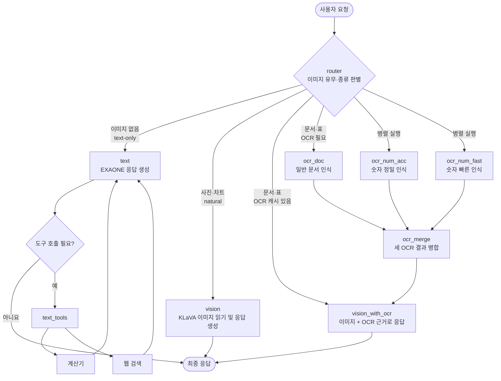

```mermaid
flowchart TD
    START(["사용자 요청"]) --> ROUTER{"router<br/>이미지 유무·종류 판별"}

    %% 텍스트 경로
    ROUTER -->|"이미지 없음<br/>text-only"| TEXT["text<br/>EXAONE 응답 생성"]
    TEXT --> CONDITION{"도구 호출 필요?"}
    CONDITION -->|"아니요"| END(["최종 응답"])
    CONDITION -->|"예"| TOOLS["text_tools"]
    TOOLS --> CALC["계산기"]
    TOOLS --> SEARCH["웹 검색"]
    CALC --> TEXT
    SEARCH --> TEXT

    %% 자연 이미지 경로
    ROUTER -->|"사진·차트<br/>natural"| VISION["vision<br/>KLaVA 이미지 읽기 및 응답 생성"]
    VISION --> END

    %% OCR 캐시 경로
    ROUTER -->|"문서·표<br/>OCR 캐시 있음"| VISION_OCR["vision_with_ocr<br/>이미지 + OCR 근거로 응답"]
    VISION_OCR --> END

    %% 신규 OCR 경로
    ROUTER -->|"문서·표<br/>OCR 필요"| OCR_DOC["ocr_doc<br/>일반 문서 인식"]
    ROUTER -->|"병렬 실행"| OCR_ACC["ocr_num_acc<br/>숫자 정밀 인식"]
    ROUTER -->|"병렬 실행"| OCR_FAST["ocr_num_fast<br/>숫자 빠른 인식"]

    OCR_DOC --> OCR_MERGE["ocr_merge<br/>세 OCR 결과 병합"]
    OCR_ACC --> OCR_MERGE
    OCR_FAST --> OCR_MERGE
    OCR_MERGE --> VISION_OCR
```